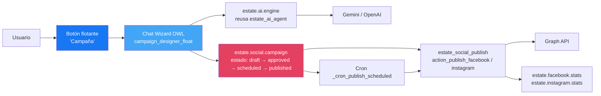

# Propuesta — Diseñador de Campañas con Chat Flotante

> **Estado:** Borrador para discusión · **Fecha:** 2026-05-04
> **Objetivo:** Implementar un chat flotante en Odoo que guíe al usuario para diseñar campañas de marketing inmobiliario y las publique automáticamente en Facebook e Instagram.

---

## 1. Visión

Hoy publicar una propiedad en redes implica:
1. Abrir la ficha de la propiedad
2. Hacer clic en "Publicar en Facebook" → texto pre-armado por código
3. Hacer clic en "Publicar en Instagram" → texto pre-armado por código
4. Sin control fino sobre tono, hashtags, horario, segmentación

**Lo que queremos:** un asistente conversacional flotante (estilo ChatGPT/Intercom) que el agente inmobiliario pueda invocar desde cualquier pantalla de Odoo, le permita armar una **campaña multi-paso** (no solo un post aislado), y la ejecute o la programe.

### Diferencia clave con el AI Chat actual
- `estate_ai_agent` es un asistente **conversacional general** (consulta datos, ayuda, recomienda).
- El **Campaign Designer** es un **wizard guiado** orientado a una tarea específica: producir un calendario de publicaciones listo para ejecutar.

---

## 2. Historia de usuario

> "Como agente inmobiliario, quiero abrir el botón flotante 'Campaña' desde la ficha de una propiedad o desde el dashboard, indicar el objetivo (venta rápida / awareness / lanzamiento de obra nueva), y que el asistente me proponga: texto del post, 3-5 hashtags relevantes, qué imágenes de la galería usar, y a qué hora publicar — todo editable antes de aprobar. Al aprobar, la campaña se publica inmediatamente o se agenda según el plan, y queda vinculada para medir su performance vía las estadísticas existentes."

---

## 3. Arquitectura propuesta



### Decisión clave: ¿módulo nuevo o ampliación?

**Recomendación: módulo nuevo `estate_social_campaigns`**.

| Ventaja | Razón |
|---|---|
| Aislamiento | El módulo de publicación atómica (`estate_social`) no se contamina con lógica de wizard |
| Opcional | El cliente puede instalar `estate_social` solo (publicar a mano) o agregar campañas |
| Tests focalizados | Suite de tests independiente |
| Dependencias claras | `depends = ['estate_social', 'estate_ai_agent']` |

---

## 4. Modelos a crear

### 4.1 `estate.social.campaign`
Representa una campaña multi-publicación.

| Campo | Tipo | Descripción |
|---|---|---|
| `name` | Char | Nombre legible (ej: "Venta rápida — Casa Centro Histórico") |
| `property_id` | M2O `estate.property` | Propiedad objetivo |
| `objective` | Selection | `sale_fast / sale_normal / rent / awareness / launch` |
| `tone` | Selection | `professional / friendly / urgent / luxury / casual` |
| `target_audience` | Char | Texto libre (ej: "familias jóvenes", "inversores") |
| `platforms` | Many2many checkbox | Facebook, Instagram, ambos |
| `state` | Selection | `draft / approved / scheduled / publishing / published / failed` |
| `created_by_ai` | Boolean | Si el draft viene del chat asistido |
| `post_ids` | O2M `estate.social.campaign.post` | Posts individuales que la componen |
| `total_engagement` | Integer (computed) | Suma de interacciones de todos sus posts |
| `roi_metric` | Float (computed) | (engagement / impresiones) × 100 |

### 4.2 `estate.social.campaign.post`
Cada publicación dentro de una campaña.

| Campo | Tipo | Descripción |
|---|---|---|
| `campaign_id` | M2O `estate.social.campaign` | Padre |
| `platform` | Selection | `facebook / instagram` |
| `caption` | Text | Texto generado por IA, editable |
| `hashtags` | Char | "#bienesraices #cuenca …" (separados por espacio) |
| `image_ids` | M2M `estate.property.image` | Imágenes seleccionadas de la galería |
| `scheduled_for` | Datetime | Fecha/hora programada (si vacío = inmediato) |
| `published_post_id` | Char | `fb_post_id` o `ig_post_id` tras publicar |
| `state` | Selection | `pending / scheduled / publishing / published / failed` |
| `error_message` | Char | Si falla, captura el error de Meta |
| `fb_stats_id` | M2O `estate.facebook.stats` | Vinculo a las stats post-publicación |
| `ig_stats_id` | M2O `estate.instagram.stats` | Vinculo a las stats post-publicación |

### 4.3 `estate.social.campaign.template` (opcional, fase 2)
Plantillas reutilizables: "Lanzamiento estándar", "Reducción de precio", etc.

---

## 5. Componente OWL — Chat flotante

### 5.1 Estructura de archivos
```
estate_social_campaigns/
├── __init__.py
├── __manifest__.py
├── models/
│   ├── __init__.py
│   ├── campaign.py             # estate.social.campaign
│   ├── campaign_post.py        # estate.social.campaign.post
│   └── campaign_ai.py          # generador de texto via Gemini/OpenAI
├── controllers/
│   └── campaign_controller.py  # endpoint /campaign/generate, /campaign/preview
├── views/
│   ├── campaign_views.xml      # form/list/kanban
│   └── campaign_menu.xml
├── data/
│   └── campaign_cron.xml       # cron _cron_publish_scheduled
├── security/
│   └── ir.model.access.csv
├── static/src/components/
│   └── campaign_designer_float/
│       ├── campaign_designer_float.js     # OWL component
│       ├── campaign_designer_float.xml    # template
│       └── campaign_designer_float.scss   # estilos
└── tests/
    ├── __init__.py
    ├── test_campaign_creation.py
    └── test_campaign_publish.py
```

### 5.2 UX del chat flotante

**Estados de la conversación:**

```
┌─────────────────────────────────────────┐
│  💬 Diseñador de Campañas       [X]     │
├─────────────────────────────────────────┤
│                                         │
│ Bot: ¿Para qué propiedad querés         │
│      armar la campaña?                  │
│                                         │
│ [📋 Buscar propiedad...]                │
│                                         │
│ Usuario: Casa Centro Histórico          │
│                                         │
│ Bot: ✅ Casa de 280m², $185,000         │
│      ¿Cuál es el objetivo?              │
│                                         │
│ [⚡ Venta rápida]  [📊 Awareness]       │
│ [🏗 Lanzamiento]   [💰 Reducción]       │
│                                         │
│ Usuario: Venta rápida                   │
│                                         │
│ Bot: ¿Tono del mensaje?                 │
│ [😊 Cercano] [💼 Profesional]           │
│ [🚀 Urgente] [💎 Lujo]                  │
│                                         │
│ Usuario: Profesional                    │
│                                         │
│ Bot: 🤖 Generando propuesta...          │
│                                         │
│ ┌── Propuesta para Facebook ──┐        │
│ │ 📝 Caption: "Oportunidad..." │        │
│ │ 🏷️ #cuenca #inversion #...   │        │
│ │ 🖼️ 3 imágenes seleccionadas  │        │
│ │ ⏰ Publicar: ahora            │        │
│ │ [✏️ Editar] [✅ Aprobar]      │        │
│ └─────────────────────────────┘        │
│                                         │
│ ┌── Propuesta para Instagram ──┐       │
│ │ 📝 Caption: "..."             │       │
│ │ ...                           │       │
│ └──────────────────────────────┘       │
│                                         │
│ [🚀 Publicar todo]  [📅 Programar]     │
│                                         │
└─────────────────────────────────────────┘
```

### 5.3 Estados internos del componente OWL
```javascript
state = {
    step: 'select_property',  // → select_objective → select_tone → generating → preview → publishing → done
    propertyId: null,
    objective: null,
    tone: null,
    platforms: ['facebook', 'instagram'],
    drafts: [],  // {platform, caption, hashtags, images, scheduled_for}
    isLoading: false,
    error: null,
}
```

---

## 6. Integraciones (reutilización)

| Componente existente | Cómo se reutiliza |
|---|---|
| `estate_ai_agent` | El backend del campaign_ai.py instancia el cliente Gemini/OpenAI con la misma config (`estate_ai.api_key`, `estate_ai.model`). NO se reescribe el cliente. |
| `estate_social_publish.action_publish_facebook` | El cron `_cron_publish_scheduled` y el botón "Publicar" llaman directamente a estos métodos para no duplicar lógica de Meta API. |
| `estate.facebook.stats._fetch_stats` | Tras publicar, se vincula automáticamente al registro de stats existente para tracking. |
| `estate.phone.mixin` | No aplica, pero seguimos el patrón de mixin para utilidades comunes (normalización de hashtags). |
| `tools/http_retry.py` | Cualquier llamada HTTP nueva (ej: si en fase 2 generamos imágenes con DALL·E o Gemini Image) usa el helper con retry. |

---

## 7. Fases de implementación

### Fase A — MVP (5-7 días)
- [ ] Modelos `estate.social.campaign` y `estate.social.campaign.post` con su CRUD básico
- [ ] Componente OWL `campaign_designer_float` con flujo lineal (sin programación, solo publicación inmediata)
- [ ] Endpoint `/campaign/generate` que usa Gemini para producir caption + hashtags
- [ ] Botón "Publicar" que llama a `action_publish_facebook` / `action_publish_instagram` existentes
- [ ] Vista list/form de campañas para revisar histórico

**Entregable:** un agente puede armar una campaña simple (1 propiedad, 1-2 plataformas, post inmediato) desde un chat flotante.

### Fase B — Programación (2-3 días)
- [ ] Campo `scheduled_for` en `campaign.post`
- [ ] Cron `_cron_publish_scheduled` que cada 15 min publica los posts cuya fecha llegó
- [ ] UI en el chat: "Publicar ahora" vs "Programar"
- [ ] Vista calendar de campañas programadas

### Fase C — Multi-post y A/B (3-4 días)
- [ ] Una campaña puede tener N posts (ej: lanzamiento día 1, recordatorio día 7, urgencia día 14)
- [ ] Plantillas (`estate.social.campaign.template`)
- [ ] A/B testing: generar 2 variantes de caption y dejar al usuario elegir o publicar ambas

### Fase D — Analytics avanzados (2 días)
- [ ] KPI por campaña: engagement total, ROI vs costo (si hay paid)
- [ ] Comparación entre campañas
- [ ] Recomendaciones del IA: "Esta campaña tuvo +40% engagement vs anteriores; replica el tono"

### Fase E — Selección inteligente de imágenes (3 días, opcional)
- [ ] El IA analiza la galería de la propiedad y sugiere las 3-5 mejores fotos según el objetivo
- [ ] Usa Gemini Vision para detectar fotos con personas, luz natural, calidad

---

## 8. Configuración necesaria

### Parámetros del sistema (`ir.config_parameter`)
| Clave | Default | Descripción |
|---|---|---|
| `estate_social_campaigns.default_objective` | `sale_normal` | Objetivo por defecto al abrir el chat |
| `estate_social_campaigns.default_tone` | `professional` | Tono por defecto |
| `estate_social_campaigns.cron_interval_minutes` | `15` | Frecuencia del cron de publicación programada |
| `estate_social_campaigns.max_drafts_per_user` | `20` | Límite anti-spam de drafts simultáneos |

### Permisos
- `estate_group_agent`: read/write/create de campañas propias
- `estate_group_manager`: read/write/create/unlink de todas
- `estate_group_admin`: idem manager + acceso a templates

---

## 9. Riesgos y dependencias

| Riesgo | Mitigación |
|---|---|
| Tokens Meta caducan o pierden permisos `pages_manage_posts` | Botón "verificar permisos" ya existe en `estate_facebook_stats` — reutilizarlo desde el chat antes de publicar |
| El IA genera texto con datos inventados de la propiedad | Pasar el contexto crudo de la propiedad al prompt y agregar instrucción "responde SOLO con datos provistos" |
| Coste de tokens IA si se generan muchos drafts | Cache: si la combinación (property_id, objective, tone) se repite, devolver el draft anterior |
| Cron de publicación falla en una campaña sin afectar a otras | Try/except por post, marcar `state='failed'` y `error_message`, continuar |
| Conflictos con el sistema de cola actual de Odoo | Usar `queue_job` opcional o `with_delay()` si está disponible |

---

## 10. Métricas de éxito

| Métrica | Meta |
|---|---|
| Tiempo desde "abrir chat" → "campaña publicada" | < 90 segundos (vs 5-10 min haciendo manual hoy) |
| Adopción: % de publicaciones del mes que pasan por el chat | > 60% en mes 2 |
| Engagement promedio por post asistido vs manual | +15% (porque el IA sugiere mejor tono/horario) |
| Tasa de error de publicación | < 3% |

---

## 11. Tareas concretas para empezar (Fase A)

```
[ ] 1.  Crear módulo estate_social_campaigns (manifest + estructura)
[ ] 2.  Modelo campaign.py + post.py con campos básicos
[ ] 3.  Permisos en ir.model.access.csv
[ ] 4.  Vista list + form de campañas
[ ] 5.  Componente OWL skeleton (botón flotante visible)
[ ] 6.  Flujo conversacional: pasos select_property → objective → tone
[ ] 7.  Backend: campaign_ai.py con función generate_caption(prop, obj, tone)
[ ] 8.  Endpoint /campaign/generate que invoca el IA
[ ] 9.  Preview en chat con caption editable
[ ] 10. Botón "Publicar" que llama a action_publish_facebook / action_publish_instagram
[ ] 11. Vincular el post publicado a estate.facebook.stats / estate.instagram.stats
[ ] 12. Tests:
       - test_campaign_creation_flow
       - test_ai_generation_with_mock_gemini
       - test_publish_routes_to_correct_platform
       - test_campaign_state_transitions
```

**Estimado total Fase A:** 5-7 días de trabajo (incluyendo tests).

---

## 12. Preguntas abiertas para validar antes de empezar

1. **¿Multi-propiedad por campaña?** Ej: campaña "lanzamiento de torre" con 5 unidades. → Recomiendo dejarlo para Fase C.
2. **¿WhatsApp Status también?** El módulo `estate_calendar` ya tiene Meta Cloud API conectada. Bajo costo añadirlo en Fase B/C.
3. **¿Preview antes de aprobar?** Mockup visual del post como se verá en FB/IG antes de publicar — alta UX, requiere componente extra. Recomiendo Fase B.
4. **¿Aprobación por el manager?** Si el agente arma la campaña pero el manager debe aprobarla antes de publicar. Workflow extra. Recomiendo Fase B con flag opcional.
5. **¿Idioma del caption?** ¿Solo español o multi-idioma (inglés para inversores extranjeros)? El IA puede generar ambos.

---

## Apéndice — Diferencia clara con el AI Chat existente

| Aspecto | `estate_ai_agent` (actual) | `estate_social_campaigns` (propuesto) |
|---|---|---|
| Naturaleza | Chat libre, conversacional | Wizard guiado paso-a-paso |
| Resultado | Texto / consulta de datos | Acción concreta: post publicado |
| Estado | Sin estado persistente largo | Persiste como `estate.social.campaign` |
| Modelos | `estate.ai.chat.history`, `estate.ai.memory` | `campaign`, `campaign.post`, `campaign.template` |
| Botón flotante | Genérico (esquina inferior derecha) | Específico para campañas (puede convivir) |
| Reutiliza | — | El AI engine de `estate_ai_agent` + el publisher de `estate_social` |

Ambos pueden coexistir. Son complementarios, no excluyentes.

---

*Próximo paso: validar las preguntas abiertas (sección 12) y aprobar el alcance de la Fase A para empezar implementación.*
