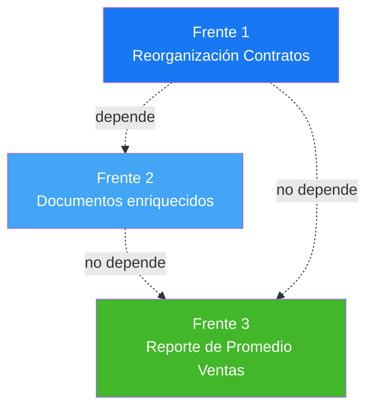

# Propuesta — Reorganización de Contratos / Documentos + Reporte de Ventas

> **Estado:** Borrador para discusión · **Fecha:** 2026-05-04
> **Objetivo:** (1) Hacer que contratos y documentos estén mejor relacionados, sean más intuitivos y fáciles de usar; (2) Añadir un reporte de **promedio de ventas** que hoy no existe.

---

## 1. Diagnóstico — qué está roto hoy

Tras auditar `estate_contract`, `estate_document` y `estate_reports`, se identificaron **3 problemas estructurales**:

### 1.1 Contratos y Documentos viven en universos paralelos
- `estate.contract` guarda documentos como **campos `Binary`** (`earnest_money_contract`, `signed_contract`, `customer_signature`) — invisibles desde la vista de documentos del cliente.
- `estate.document` guarda documentos en su propio modelo, pero **no tiene FK a `estate.contract`**.
- Resultado: cuando un asesor abre la ficha del cliente y va a "Documentos", **no ve el contrato firmado** (vive como Binary en otro lado).

### 1.2 Vista del contrato confusa (UX trap)
- La pestaña **"Firma Digital"** es invisible hasta que existe firma → el usuario nunca encuentra dónde firmar la primera vez.
- Las acciones (`Activar`, `Cancelar`, `Marcar Vencido`, `Reset Borrador`) están repartidas sin un flujo visual claro.
- Al aceptar una oferta se crea un contrato en background pero el usuario no recibe notificación visible — solo puede descubrirlo haciendo refresh.

### 1.3 Tipos de documento insuficientes para inmobiliaria
Hoy `estate.document.type` solo tiene: `contract / legal / identification / deed / certificate / other`. Faltan típicos del negocio:
- **Avalúo / tasación** (vinculado a `estate.appraisal`)
- **Comprobante de pago / depósito**
- **Poder notarial**
- **Certificado de no adeudo (impuesto predial)**
- **Registro catastral**
- **Licencia de construcción / habitabilidad**

Sin estados de ciclo de vida (`pendiente / entregado / verificado / archivado`).

### 1.4 No existe reporte de "promedio de ventas"
Hay un dashboard genérico, pero ningún reporte que responda preguntas concretas como:
- ¿Cuál es el precio promedio de venta este trimestre vs trimestre anterior?
- ¿Cuántos días tarda en venderse una propiedad de tipo "Casa" en Cuenca?
- ¿Qué % del precio listado se logra al cierre? (por asesor, por tipo, por ciudad)
- ¿Qué asesor está vendiendo más caro / más barato vs el promedio?

---

## 2. Plan de mejora — 3 frentes paralelos



Los 3 frentes pueden trabajarse en orden: F2 → F1 → F3, o en paralelo si hay capacidad.

---

## 3. FRENTE 1 — Reorganización de Contratos (UX + relaciones)

### 3.1 Vista form rediseñada
Pestañas ordenadas por **flujo lógico del contrato**, todas siempre visibles:

```
┌─────────────────────────────────────────────────────────────┐
│ [Borrador] → [Activo] → [Vencido]    [⚠ Cancelado]          │  ← statusbar arriba
├─────────────────────────────────────────────────────────────┤
│ Contrato CT-2026-0042                           [💰 $120k]  │
│ Propiedad: Casa Cdla Ingenieros                              │
│ Cliente: Juan Pérez                                          │
├─────────────────────────────────────────────────────────────┤
│ ⚙️ Detalles | 📅 Pagos | ✍️ Firma | 📎 Documentos | 📝 Notas│
└─────────────────────────────────────────────────────────────┘
```

**Cambios concretos:**
- [ ] **Statusbar** visual arriba con los estados como botones (Borrador → Activo → Vencido)
- [ ] **Pestaña "Firma" siempre visible** con un widget de firma digital empotrado (no `invisible="not customer_signature"`)
- [ ] **Pestaña "Documentos" reemplaza los campos `Binary`**: muestra un O2M a `estate.document` filtrado por este contrato (ver Frente 2)
- [ ] **Smart-buttons arriba**: `[12 Pagos]` `[3 Documentos]` `[1 Factura]` con conteos en vivo
- [ ] **Header con badge económico**: monto del contrato grande y visible

### 3.2 Flujo oferta → contrato más claro
- [ ] Al aceptar una oferta, mostrar un **diálogo modal** "Contrato creado" con botón "Abrir contrato" en lugar de crearlo silenciosamente
- [ ] Añadir una notificación en el chatter del lead/oferta: "Contrato CT-XXX generado"
- [ ] El campo `offer_id` en el contrato actualmente es M2O — añadir botón "Ver oferta original" en la vista form

### 3.3 State machine ampliada (alquileres)
Estados actuales (`draft / active / expired / cancelled`) se quedan cortos para alquileres largos. Añadir:
- [ ] `suspended` — contrato pausado (impago, juicio, etc.)
- [ ] `renewing` — en proceso de renovación
- [ ] `renewed` — renovado, vinculando al contrato hijo (`parent_contract_id`)

### 3.4 Migración de campos `Binary` a `estate.document`
- [ ] Crear migration script en `data/migrations/` que convierta los `Binary` existentes en registros de `estate.document` vinculados al contrato
- [ ] Mantener los campos como `related/computed` para no romper integraciones existentes
- [ ] En 1-2 versiones futuras, deprecar los campos `Binary` totalmente

### 3.5 Archivos a tocar
```
estate_management/
├── models/estate_contract.py        # state machine ampliada, smart-buttons, métodos de migración
├── views/estate_contract_views.xml  # rediseño form completo
└── data/migration_documents.py      # script de migración Binary → estate.document
```

**Estimado:** 3-4 días.

---

## 4. FRENTE 2 — Documentos enriquecidos y centralizados

### 4.1 Ampliar tipos de documento
Convertir `estate.document.type` de Selection a un **modelo configurable** (`estate.document.type`) con seeds:

| Categoría | Tipos |
|---|---|
| **Contrato** | Contrato firmado, Arras, Adenda, Acuerdo confidencialidad |
| **Identidad** | Cédula, Pasaporte, RUC |
| **Propiedad** | Escritura, Predio, Catastro, Habitabilidad, Licencia construcción |
| **Financiero** | Comprobante pago, Avalúo, Tasación bancaria, Carta de crédito |
| **Legal** | Poder notarial, Certificado matrimonial, Sucesión, No adeudo |

Cada categoría con icono y color para reconocimiento visual rápido.

### 4.2 Ciclo de vida del documento
Añadir campo `state`:

```
[Pendiente] → [Recibido] → [Verificado] → [Archivado]
                              ↓
                          [Rechazado]
```

- [ ] Campo `state` Selection con los 5 estados
- [ ] Campo `verified_by` (M2O `res.users`) — quién verificó
- [ ] Campo `verified_date` (Datetime)
- [ ] Botón `action_verify` con permiso para `estate_group_manager`
- [ ] Decoraciones en list view por estado

### 4.3 Relación con contratos (LA QUE FALTA)
- [ ] Añadir FK `contract_id = M2O('estate.contract', ondelete='set null')` en `estate.document`
- [ ] Smart-button "Ver documentos" en vista de contrato → filtra por `contract_id`
- [ ] **Auto-creación**: cuando se firma un contrato (`action_activate`), crear automáticamente:
  - 1 documento tipo "Contrato firmado" (con el archivo binary actual como adjunto)
  - 1 documento tipo "Cédula del cliente" (placeholder pendiente, recordatorio al asesor)

### 4.4 Confidencialidad y permisos
- [ ] Campo `confidentiality` Selection: `public / internal / restricted / confidential`
- [ ] `restricted` → solo asesor responsable + manager ve el archivo
- [ ] `confidential` → solo manager y admin (datos bancarios, ID escaneados)
- [ ] Reglas de registro (`ir.rule`) por confidencialidad

### 4.5 Vista unificada "Carpeta del Cliente"
Hoy un asesor que quiere ver todo lo del cliente Juan tiene que:
1. Abrir Juan en res.partner → ver smart-buttons
2. Hacer clic en propiedades → ver documentos por propiedad
3. Hacer clic en leads → ver documentos por lead
4. Y los del contrato no aparecen.

**Solución:** un botón "📂 Carpeta completa" en `res.partner` que abra una vista kanban agrupada por categoría de documento, mostrando TODOS sus documentos (de propiedades + leads + contratos + identidad personal).

### 4.6 Archivos a tocar
```
estate_document/
├── models/
│   ├── estate_document.py           # añadir campos state, confidentiality, contract_id, verified_*
│   ├── estate_document_type.py      # NUEVO modelo (era Selection)
│   └── res_partner.py               # método action_view_full_folder
├── data/document_types_data.xml     # seeds de los nuevos tipos
├── security/
│   ├── ir.model.access.csv          # permisos de tipo
│   └── document_record_rules.xml    # reglas de confidencialidad
└── views/
    ├── estate_document_views.xml    # statusbar, decoraciones, kanban por categoría
    └── res_partner_views.xml        # botón "Carpeta completa"
```

**Estimado:** 4-5 días.

---

## 5. FRENTE 3 — Reporte de Promedio de Ventas

### 5.1 Modelo: `estate.sales.report` (TransientModel wizard)
Wizard que permite generar reportes con filtros y vista pivot/gráfico/PDF.

**Filtros:**
- Período: `last_30 / last_90 / quarter / year / custom`
- Tipo de propiedad (M2M)
- Ciudad (Char con autocomplete)
- Asesor (M2M `res.users`)
- Tipo de operación (`sale / rent / both`)

### 5.2 KPIs calculados

| KPI | Fórmula | Ejemplo |
|---|---|---|
| **Precio promedio de venta** | AVG(`price`) de propiedades en estado `sold` en el período | $145,300 |
| **Precio promedio de listado** | AVG(`price`) inicial (antes de ajustes) | $158,200 |
| **% logrado vs listado** | Σ(precio_venta) / Σ(precio_listado) × 100 | 91.8% |
| **Días promedio en mercado** | AVG(`days_on_market`) | 42 días |
| **Mediana de venta** | MEDIAN(`price`) | $135,000 |
| **Min / Max** | MIN, MAX precios | $80k / $420k |
| **Tasa de cierre** | (vendidas / disponibles + vendidas) × 100 | 28% |
| **Variación vs período anterior** | ((actual - anterior) / anterior) × 100 | +12.3% |

### 5.3 Visualizaciones

**Tab 1: Resumen** — 8 KPI cards estilo Facebook Insights con la métrica grande y comparativa con período anterior:
```
┌─────────────────┐  ┌─────────────────┐  ┌─────────────────┐
│ Precio Promedio │  │ Días en Mercado │  │ % vs Listado    │
│   $145,300      │  │     42 días     │  │     91.8%       │
│   ↑ 12.3%       │  │   ↓ 8 días      │  │   ↑ 2.1pp       │
└─────────────────┘  └─────────────────┘  └─────────────────┘
```

**Tab 2: Gráficos**
- Línea: evolución del precio promedio mes a mes
- Barras: top 5 ciudades por volumen de ventas
- Barras horizontales: ranking de asesores por monto vendido
- Pie: distribución por tipo de propiedad

**Tab 3: Detalle**
- Lista pivot: filas=mes, columnas=tipo de propiedad, valor=precio promedio
- Tabla de propiedades vendidas en el período (drilldown)

**Tab 4: Insights IA** (opcional, fase 2)
- Texto generado por Gemini interpretando los datos: "El precio promedio subió 12% este Q vs anterior, impulsado por ventas de tipo 'Casa' en Cuenca. El asesor Juan Pérez vende un 8% por encima del promedio."

### 5.4 Exportación
- [ ] **PDF**: reporte ejecutivo de 2-3 páginas usando QWeb (template `estate_reports.report_avg_sales`)
- [ ] **Excel**: hoja con todos los datos crudos + hojas de gráficos (xlsxwriter)
- [ ] **Email**: opción "Enviar por email" al gerente con el PDF adjunto

### 5.5 Archivos a tocar
```
estate_reports/
├── models/
│   ├── estate_sales_report.py       # NUEVO wizard transient
│   └── estate_dashboard.py          # añadir 3 widgets resumen del avg
├── report/
│   ├── report_avg_sales.xml         # NUEVO PDF QWeb
│   └── report_avg_sales_excel.py    # NUEVO export xlsx
├── views/
│   └── estate_sales_report_views.xml # form wizard, tabs, gráficos
└── tests/
    └── test_avg_sales_kpis.py        # validar fórmulas con dataset fijo
```

**Estimado:** 3-4 días.

---

## 6. Orden de implementación recomendado

| Orden | Frente | Por qué |
|---|---|---|
| **1º** | F2 - Documentos | Es prerequisito de F1: el modelo `estate.document` mejorado se usa en la nueva vista de contratos |
| **2º** | F1 - Contratos | Reutiliza la vista mejorada de documentos |
| **3º** | F3 - Reporte | Independiente, puede hacerse en paralelo cuando se desee |

**Total estimado:** 10-13 días para los 3 frentes.

---

## 7. Tabla resumen de cambios

| Cambio | Antes | Después |
|---|---|---|
| Documentos del contrato | Campos `Binary` invisibles | Registros `estate.document` enlazados |
| Firma del cliente | Pestaña invisible hasta que firme | Widget de firma siempre visible |
| Tipos de documento | 6 fijos en Selection | ~25+ en modelo configurable |
| Estado de documento | Sin estado (todo "subido") | `pendiente → recibido → verificado → archivado` |
| Confidencialidad doc | Sin control | `public / internal / restricted / confidential` con `ir.rule` |
| Carpeta cliente | 3 lugares dispersos | 1 vista unificada con kanban por categoría |
| Reporte de ventas | NO existe | Wizard con KPIs, gráficos, PDF, Excel |
| Comparación períodos | NO existe | "+12.3% vs trimestre anterior" |
| Generación contrato desde oferta | Silenciosa, requiere refresh | Modal con botón "Abrir contrato" |

---

## 8. Riesgos y mitigaciones

| Riesgo | Mitigación |
|---|---|
| Migrar `Binary → estate.document` puede perder archivos en bases existentes | Script de migración con dry-run primero, rollback automático ante error |
| Cambiar Selection a modelo rompe vistas de Odoo Studio | Mantener helper `_get_legacy_type()` para compat |
| Reglas de `ir.rule` por confidencialidad pueden bloquear queries existentes | Probar primero como `groups` checks, después promover a `ir.rule` |
| El reporte de promedio con N grande es lento | Usar `read_group` agregado en SQL, no Python loop |
| Tests existentes (74) se rompen al cambiar `estate.contract` | Ejecutar suite tras cada cambio importante; añadir tests nuevos antes de refactor |

---

## 9. Criterios de aceptación (Definition of Done)

### Frente 1 - Contratos
- [ ] Pestaña Firma visible siempre, con widget funcional
- [ ] Smart-buttons con conteos correctos
- [ ] Al aceptar oferta, modal con "Abrir contrato"
- [ ] Documentos del contrato visibles también en la vista de documentos
- [ ] Estados `suspended / renewing / renewed` con transiciones documentadas

### Frente 2 - Documentos
- [ ] ≥20 tipos de documento seedeados
- [ ] Campo `contract_id` poblado para todos los docs creados desde contrato
- [ ] Vista "Carpeta completa" en cliente muestra TODOS los docs agrupados
- [ ] `restricted` impide ver el archivo a usuarios sin permiso
- [ ] Tests: ≥6 tests del ciclo de vida del documento

### Frente 3 - Reporte de Ventas
- [ ] Wizard con 5 filtros funcionales
- [ ] 8 KPIs correctos (validados con tests)
- [ ] Comparación con período anterior
- [ ] Export PDF y Excel funcionales
- [ ] Tests: ≥4 tests de cálculo de promedios con datasets controlados

---

## 10. Tareas concretas (~30 tickets)

### Frente 2 - Documentos ✅ *completado*
```
[x] D1.  Modelo estate.document.type con name, code, category, icon, color, sequence
[x] D2.  Selection → M2O type_id en estate.document
[x] D3.  Seed XML con 26 tipos en 6 categorías (contract, identity, property, financial, legal, other)
[x] D4.  Campo state (pending → received → verified → rejected → archived)
[x] D5.  Campos verified_by, verified_date, action_verify (solo manager)
[x] D6.  Campo confidentiality + ir.rule fail-closed (public/internal/restricted/confidential)
[x] D7.  contract_id (M2O estate.contract) con index
[x] D8.  Auto-creación de placeholders al action_activate del contrato
[x] D9.  Vista list con statusbar y decoraciones por estado/confidencialidad
[x] D10. Vista kanban agrupada por type_category con badges
[x] D11. Botón "📂 Carpeta completa" en res.partner (action_view_full_folder)
[x] D12. Tests: 24 tests verdes (lifecycle + confidentiality + contract integration)
```

**Bonus añadidos durante implementación:**
- Modelos extraídos en archivos separados (estate_document_type.py, estate_property.py, crm_lead.py, res_partner.py, estate_contract.py)
- Wizard de rechazo de documento con razón obligatoria
- Auto-transición pending → received al subir archivo
- Heredada `mail.thread` para chatter en documentos
- Campo `expiration_date` para certificados con vencimiento
- Filtro "Expira en 30 días" en search view
- Permisos para `estate.document.type` (gestionable solo por managers)

### Frente 1 - Contratos ✅ *completado*
```
[x] C1.  Estados ampliados: suspended, renewing, renewed + parent_contract_id / child_contract_ids
[x] C2.  Statusbar visible con los nuevos estados (statusbar_visible="draft,active,suspended,renewing,renewed,expired")
[x] C3.  Smart-buttons: Pagos, Documentos (vía estate_document), Facturas, Ver Oferta
[x] C4.  Pestaña Firma SIEMPRE visible con widget="signature" + instrucciones cuando vacío
[x] C5.  Pestaña "📂 Documentos del Contrato" con O2M a estate.document filtrado por contract_id
[x] C6.  Banner verde en sheet al crear desde oferta (context show_contract_creation_banner)
[x] C7.  Mensaje destacado en chatter del lead con HTML alert + link directo "Abrir contrato"
[x] C8.  Smart-button "Ver Oferta" + action_view_offer
[x] C9.  Método _migrate_binary_to_documents (idempotente, mapea earnest/signed → estate.document)
[x] C10. 11 tests del state machine + transitions + smart-buttons + child contracts
```

**Bonus añadidos durante implementación:**
- Botones diferenciados por estado: Suspender / Reanudar / Iniciar Renovación / Crear Renovación
- Banners contextuales: contrato suspendido (warning), renovado (info), recién creado (success)
- Header con título + monto + propiedad + cliente en una línea
- Badge "Renovación de CT-XXX" si tiene parent
- Pestaña "🔄 Renovaciones" con lista de contratos hijos (visible solo si los tiene)
- Pestaña "📂 Anexos heredados" visible solo si hay datos legados (los Binary actuales)
- Decoraciones de filas en list view: warning para suspended/renewing, muted para renewed/cancelled

### Frente 3 - Reporte de Ventas ✅ *completado*
```
[x] R1.  Modelo estate.sales.report.wizard (TransientModel) en wizards/estate_sales_report_wizard.py
[x] R2.  Filtros: período (5 opciones), tipo M2M, ciudad, asesores M2M, operación (sale/rent/both)
[x] R3.  9 KPIs: avg_price, avg_listed, pct_vs_listed, avg_days, median, min, max, close_rate, count
[x] R4.  Comparación con período anterior: prev_avg_price, pct_change_avg, prev_avg_days, pct_change_days
[x] R5.  Vista wizard con 4 tabs (Resumen, Detalle, Datos crudos, Exportar)
[x] R6.  PDF QWeb template con KPI cards visuales + estadísticos + top ciudades/asesores
[x] R7.  Export Excel xlsxwriter (2 hojas: KPIs + Detalle) con controlador HTTP de descarga
[x] R8.  14 tests: cálculo correcto, filtros, period validation, chart data, export xlsx
```

**Bonus añadidos:**
- Banner amigable cuando no hay datos en el período
- Botón "Ver propiedades del período" que abre la lista filtrada
- Filtros aplicados visibles en el PDF (ciudad, tipos, asesores)
- KPI cards con flecha ↑/↓ y % de cambio vs período anterior
- Datos chart_data agregados (top cities, top users, types) listos para gráficos
- Mensaje de error claro si xlsxwriter no está instalado
- Pestaña "Datos crudos" oculta para usuarios normales (solo dev mode)

---

## 11. Preguntas abiertas

1. **¿Migrar los `Binary` existentes** o solo aplicar la lógica nueva a contratos futuros?
   - *Recomiendo migrar con script para tener consistencia*.
2. **¿La firma digital debe ser legalmente vinculante** (e-signature certificada como DocuSign) o sólo dibujada?
   - *MVP con dibujada (widget signature de Odoo); integración legal en fase 2*.
3. **¿El reporte "promedio de ventas" debe incluir alquileres** o solo ventas?
   - *Filtro `tipo de operación` que permite elegir. Default: solo ventas*.
4. **¿La carpeta unificada del cliente** debe descargar como ZIP?
   - *Sí, agregar botón "Descargar todo (ZIP)" — muy útil para enviar a notaría*.
5. **¿Comparativa entre asesores** se muestra a todos los asesores o solo al manager?
   - *Recomiendo: cada asesor ve solo el suyo + promedio de la oficina (sin nombres). Manager ve todo*.

---

*Próximo paso: validar las preguntas abiertas y aprobar el orden de los frentes para empezar implementación.*
