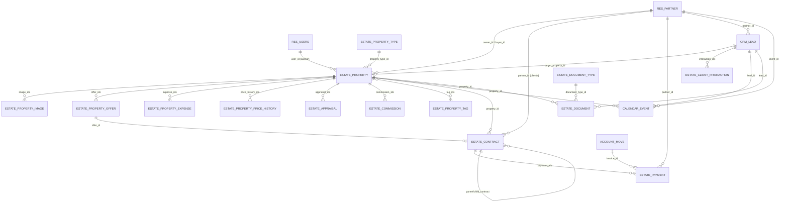
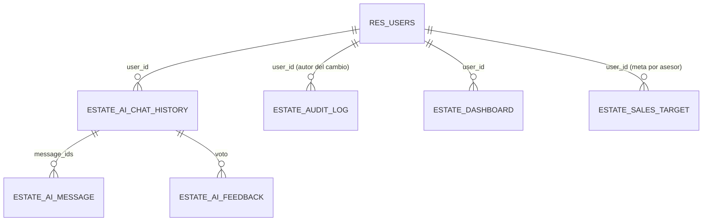

# Diagrama Entidad-Relación (ERD) y Diccionario de Datos

**Proyecto:** Sistema de gestión inmobiliaria sobre ERP Odoo 19 (PostgreSQL).
**Base de datos:** `tesis_odoo19` (PostgreSQL).

> El modelo se construye sobre entidades nativas de Odoo (`res.partner`, `res.users`, `crm.lead`, `calendar.event`, `account.move`) extendidas con entidades propias del dominio inmobiliario.

---

## 1. Diagrama Entidad-Relación (núcleo del dominio)

---

## 2. Entidades de soporte (IA, auditoría, reportes)

---

## 3. Diccionario de datos (entidades principales)

### 3.1. `estate.property` — Propiedad

| Campo | Tipo | Descripción |
|-------|------|-------------|
| name | Char | Referencia interna (PROP-XXXX) |
| title | Char | Título comercial |
| description | Html | Descripción |
| property_type_id | Many2one → estate.property.type | Tipo (casa, departamento…) |
| offer_type | Selection | Venta / Arriendo |
| street, city, state_id, country_id, zip_code | Char/M2o | Ubicación |
| latitude, longitude | Float | Coordenadas GPS |
| price, bottom_price | Float | Precio publicado / mínimo |
| area, bedrooms, bathrooms, parking_spaces, floor, year_built | Float/Int | Atributos físicos |
| state | Selection | disponible / reservada / vendida / arrendada |
| avm_estimated_price, avm_status, avm_last_calculated | Float/Sel/Datetime | Valoración automática (AVM) |
| ai_vision_description | Text | Descripción generada por IA |
| owner_id, buyer_id | Many2one → res.partner | Propietario / comprador |
| user_id, co_user_id | Many2one → res.users | Asesor / co-asesor |
| tag_ids | Many2many → estate.property.tag | Etiquetas |
| wp_published, wp_post_id | Bool/Int | Estado de sincronización WordPress |

### 3.2. `estate.contract` — Contrato

| Campo | Tipo | Descripción |
|-------|------|-------------|
| name | Char | Número de contrato |
| property_id | Many2one → estate.property | Propiedad |
| partner_id | Many2one → res.partner | Cliente |
| user_id | Many2one → res.users | Asesor |
| offer_id | Many2one → estate.property.offer | Oferta origen |
| contract_type | Selection | Venta / Arriendo |
| date_start, date_end | Date | Vigencia |
| amount | Float | Monto |
| state | Selection | borrador / activo / suspendido / renovado / vencido / cancelado |
| parent_contract_id, child_contract_ids | M2o/O2m | Renovaciones encadenadas |
| payment_ids | One2many → estate.payment | Pagos |
| total_paid, payment_count | Float/Int | Saldos calculados |
| customer_signature, signed_contract | Binary | Firma y documento firmado |

### 3.3. `estate.payment` — Pago

| Campo | Tipo | Descripción |
|-------|------|-------------|
| name | Char | Referencia del pago |
| contract_id | Many2one → estate.contract | Contrato |
| property_id | Many2one → estate.property | Propiedad |
| partner_id | Many2one → res.partner | Pagador |
| amount | Float | Monto |
| date | Date | Fecha |
| payment_method | Selection | Método |
| state | Selection | Estado del pago |
| invoice_id | Many2one → account.move | Factura asociada |

### 3.4. `crm.lead` (extendido) — Lead / Oportunidad

| Campo | Tipo | Descripción |
|-------|------|-------------|
| target_property_id | Many2one → estate.property | Propiedad objetivo |
| client_budget | Float | Presupuesto del cliente |
| match_percentage | Integer | % de coincidencia con propiedades |
| preferred_property_type_id, preferred_city, preferred_bedrooms | M2o/Char/Int | Preferencias |
| lead_score | Selection | A / B / C |
| lead_temperature | Selection | frío / tibio / caliente / hirviendo |
| expected_revenue, expected_commission | Float | Proyección comercial |

### 3.5. `calendar.event` (extendido) — Visita / Cita

| Campo | Tipo | Descripción |
|-------|------|-------------|
| property_id | Many2one → estate.property | Propiedad a visitar |
| client_id | Many2one → res.partner | Cliente de la visita |
| lead_id | Many2one → crm.lead | Oportunidad de origen |
| appointment_type | Selection | Visita / Reunión / Llamada / Firma |
| visit_state | Selection | Programada / Realizada / Cancelada |
| visit_result, visit_rating | Selection | Resultado y calificación |
| whatsapp_sent, survey_sent | Boolean | Control de notificaciones |
| gcal_event_id | Char | ID del evento en Google Calendar compartido |

### 3.6. `estate.document` — Documento

| Campo | Tipo | Descripción |
|-------|------|-------------|
| property_id, lead_id, partner_id | Many2one | Vínculo del documento |
| document_type_id | Many2one → estate.document.type | Tipo de documento |
| ocr_result | Text | Texto extraído por OCR (Gemini Vision) |

---

## 4. Notas de diseño

- Todas las entidades del dominio heredan `mail.thread` y `mail.activity.mixin` (chatter, seguimiento y actividades).
- Las entidades con teléfono usan el mixin `estate.phone.mixin`; las que usan IA, el mixin `estate.genai.mixin`.
- La integridad referencial se gestiona con `ondelete` apropiado (ej. `estate.property.property_id` en visitas usa `set null` para no perder el historial).

---

*Diagrama ERD y diccionario de datos — Proyecto de Titulación, UPS Sede Cuenca.*
