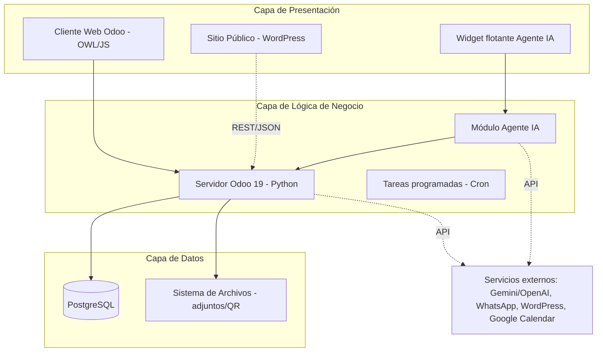

# I. PORTADA

**UNIVERSIDAD POLITÉCNICA SALESIANA**
**SEDE CUENCA**
**CARRERA DE COMPUTACIÓN**

 

**DISEÑO E IMPLEMENTACIÓN DE UN SISTEMA DE GESTIÓN INMOBILIARIA BASADO EN ERP ODOO CON INTEGRACIÓN DE UN AGENTE INTELIGENTE PARA CONSULTA Y GENERACIÓN DE REPORTES**

 

Trabajo de titulación previo a la obtención del
Título de Ingeniero en Ciencias de la Computación

 

**AUTOR:** JUSTIN MATEO LUCERO REYES
**TUTOR:** ING. CRISTIAN FERNANDO TIMBI SISALIMA

  

Cuenca – Ecuador

2026

---

# II. CERTIFICADO DE RESPONSABILIDAD Y AUTORÍA DEL TRABAJO DE TITULACIÓN

Yo, **Justin Mateo Lucero Reyes** con documento de identificación N° `<xxxxxxxxxx>` manifiesto que:

Soy el autor y responsable del presente trabajo; y, autorizo a que sin fines de lucro la Universidad Politécnica Salesiana pueda usar, difundir, reproducir o publicar de manera total o parcial el presente trabajo de titulación.

Cuenca, `<día>` de `<mes>` del 2026

Atentamente,

 

_________________________________________
Justin Mateo Lucero Reyes
`<Número de Cédula>`

---

# III. CERTIFICADO DE CESIÓN DE DERECHOS DE AUTOR DEL TRABAJO DE TITULACIÓN A LA UNIVERSIDAD POLITÉCNICA SALESIANA

Yo, **Justin Mateo Lucero Reyes** con documento de identificación No. `<xxxxxxxxxx>`, expreso mi voluntad y por medio del presente documento cedo a la Universidad Politécnica Salesiana la titularidad sobre los derechos patrimoniales en virtud de que soy autor del Proyecto Técnico: *"Diseño e Implementación de un Sistema de Gestión Inmobiliaria Basado en ERP Odoo con Integración de un Agente Inteligente para Consulta y Generación de Reportes"*, el cual ha sido desarrollado para optar por el título de Ingeniero en Ciencias de la Computación, en la Universidad Politécnica Salesiana, quedando la Universidad facultada para ejercer plenamente los derechos cedidos anteriormente.

En concordancia con lo manifestado, suscribo este documento en el momento que hago la entrega del trabajo final en formato digital a la Biblioteca de la Universidad Politécnica Salesiana.

Cuenca, `<día>` de `<mes>` del 2026

Atentamente,

 

_________________________________________
Justin Mateo Lucero Reyes
`<Número de Cédula>`

---

# IV. CERTIFICADO DE DIRECCIÓN DEL TRABAJO DE TITULACIÓN

Yo, **Ing. Cristian Fernando Timbi Sisalima** con documento de identificación N° `<número de cédula del docente>`, docente de la Universidad Politécnica Salesiana, declaro que bajo mi tutoría fue desarrollado el trabajo de titulación: **DISEÑO E IMPLEMENTACIÓN DE UN SISTEMA DE GESTIÓN INMOBILIARIA BASADO EN ERP ODOO CON INTEGRACIÓN DE UN AGENTE INTELIGENTE PARA CONSULTA Y GENERACIÓN DE REPORTES**, realizado por Justin Mateo Lucero Reyes con documento de identificación N° `<xxxxxxxxxx>`, obteniendo como resultado final el trabajo de titulación bajo la opción Proyecto Técnico que cumple con todos los requisitos determinados por la Universidad Politécnica Salesiana.

Cuenca, `<día>` de `<mes>` del 2026

Atentamente,

 

_________________________________________
Ing. Cristian Fernando Timbi Sisalima, `<TIT IV NIVEL>`
`<número de cédula del docente>`

---

# V. DEDICATORIA Y AGRADECIMIENTO

`<Opcional — espacio para que el autor redacte la dedicatoria y los agradecimientos personales.>`

---

# VI. RESUMEN

El presente proyecto técnico aborda la problemática de la gestión inmobiliaria de la empresa Inmobi, ubicada en la ciudad de Cuenca (Ecuador), la cual administraba sus procesos de propiedades, clientes y contratos mediante hojas de cálculo, registros manuales y aplicaciones no integradas. Esta forma de trabajo generaba duplicación de información, pérdida de datos, ausencia de seguimiento de las negociaciones y dificultad para producir reportes confiables que apoyaran la toma de decisiones, traduciéndose en retrasos en la atención y pérdida de oportunidades de venta.

Como solución se diseñó e implementó un sistema integral de gestión inmobiliaria sobre el ERP de código abierto **Odoo 19 Community** (Python, PostgreSQL y el framework de interfaz OWL), compuesto por **doce módulos personalizados** que cubren el ciclo completo del negocio: registro de propiedades con valoración automática (AVM) y generación de código QR; CRM con puntuación de leads (A/B/C), temperatura comercial y algoritmo de coincidencia presupuestal; gestión de contratos, pagos y comisiones; agenda de visitas con recordatorios automáticos por WhatsApp y sincronización con Google Calendar; gestión documental con extracción de texto mediante OCR; tableros de indicadores (KPI) con exportación a PDF y Excel; sincronización automática con el sitio web en WordPress; portal del propietario; y bitácora de auditoría.

El componente diferenciador es un **agente inteligente** integrado mediante las APIs de **Google Gemini y OpenAI**, que dispone de más de cuarenta herramientas para consultar el sistema en lenguaje natural, crear y actualizar registros, generar reportes y documentos, analizar imágenes de propiedades y emitir alertas proactivas. El desarrollo se ejecutó bajo la metodología ágil **Scrum**, en seis sprints, con validación continua del cliente.

La solución fue verificada mediante una batería de **129 pruebas automatizadas** (unitarias y de integración) ejecutadas con el framework de pruebas de Odoo, todas superadas satisfactoriamente, lo que constituye evidencia objetiva de la correcta operación de la lógica de negocio. El sistema centraliza la información en una única fuente de verdad, automatiza tareas críticas mediante diez tareas programadas y habilita el acceso a la información mediante lenguaje natural, atendiendo de forma directa las falencias identificadas en la empresa Inmobi.

**Palabras clave:** ERP, Odoo, gestión inmobiliaria, agente inteligente, procesamiento de lenguaje natural, CRM, automatización, Google Gemini.

---

# VII. ABSTRACT

This technical project addresses the real estate management problem of the company Inmobi, located in the city of Cuenca (Ecuador), which managed its property, client and contract processes through spreadsheets, manual records and non-integrated applications. This way of working led to data duplication, information loss, lack of negotiation follow-up and difficulty producing reliable reports to support decision-making, resulting in delays in service and lost sales opportunities.

As a solution, an integral real estate management system was designed and implemented on the open-source ERP **Odoo 19 Community** (Python, PostgreSQL and the OWL interface framework), composed of **twelve custom modules** covering the full business cycle: property registration with automated valuation (AVM) and QR code generation; a CRM with lead scoring (A/B/C), commercial temperature and a budget-matching algorithm; management of contracts, payments and commissions; visit scheduling with automatic WhatsApp reminders and Google Calendar synchronization; document management with OCR text extraction; KPI dashboards with PDF and Excel export; automatic synchronization with the WordPress website; an owner portal; and an audit log.

The differentiating component is an **intelligent agent** integrated through the **Google Gemini and OpenAI** APIs, providing more than forty tools to query the system in natural language, create and update records, generate reports and documents, analyze property images and issue proactive alerts. Development followed the agile **Scrum** methodology over six sprints, with continuous client validation.

The solution was verified through a suite of **129 automated tests** (unit and integration) executed with the Odoo testing framework, all successfully passed, providing objective evidence of the correct operation of the business logic. The system centralizes information into a single source of truth, automates critical tasks through ten scheduled jobs and enables information access through natural language, directly addressing the shortcomings identified at Inmobi.

**Keywords:** ERP, Odoo, real estate management, intelligent agent, natural language processing, CRM, automation, Google Gemini.

---

# VIII. ÍNDICE DE CONTENIDO

1. Introducción
2. Problema
   - 2.1 Descripción del problema
   - 2.2 Antecedentes
   - 2.3 Importancia y alcances
   - 2.4 Delimitación
3. Objetivos
   - 3.1 Objetivo general
   - 3.2 Objetivos específicos
4. Revisión de la literatura / Fundamentos teóricos
   - 4.1 Sistemas ERP y su evolución
   - 4.2 Arquitectura y extensibilidad de Odoo
   - 4.3 Agentes inteligentes y chatbots
   - 4.4 Modelos de lenguaje y procesamiento de lenguaje natural
   - 4.5 Sincronización: WordPress, ERP y mensajería
   - 4.6 Valoración automática de inmuebles (AVM)
   - 4.7 Trabajos relacionados
5. Marco metodológico
6. Resultados
7. Cronograma
8. Presupuesto
9. Conclusiones
10. Recomendaciones
11. Referencias bibliográficas
12. Anexos

---

# IX. INTRODUCCIÓN

La transformación digital de las pequeñas y medianas empresas (PYMES) se ha convertido en un factor determinante de su competitividad. La capacidad de centralizar la información, automatizar tareas repetitivas y apoyar la toma de decisiones con datos confiables marca la diferencia entre una operación ágil y una que pierde oportunidades por desorganización. En el sector inmobiliario, donde se administra un gran volumen de información sobre propiedades, clientes, contratos, pagos y visitas —datos que además cambian con rapidez—, la correcta gestión de la información resulta especialmente crítica.

A pesar de la disponibilidad de tecnologías modernas, numerosas empresas del sector continúan operando con herramientas dispersas: hojas de cálculo individuales, cuadernos, mensajes sueltos y aplicaciones que no son de su propiedad ni están integradas entre sí. Esta fragmentación limita el control de la información, produce inconsistencias y dificulta el seguimiento de las operaciones, afectando directamente la calidad del servicio al cliente.

El presente trabajo de titulación, desarrollado bajo la modalidad de Proyecto Técnico, propone el diseño e implementación de un **sistema integral de gestión inmobiliaria** construido sobre el ERP de código abierto **Odoo 19**, complementado con un **agente inteligente** basado en grandes modelos de lenguaje (Google Gemini y OpenAI) que habilita la consulta de información y la generación de reportes mediante lenguaje natural. La solución fue desarrollada para la empresa **Inmobi** de la ciudad de Cuenca, atendiendo sus necesidades reales.

El sistema se concibe como una plataforma modular que abarca el ciclo completo del negocio inmobiliario y se integra con servicios externos (WhatsApp, WordPress, Google Calendar y APIs de inteligencia artificial). El presente documento expone el problema y su contexto, los objetivos planteados, la fundamentación teórica que sustenta las decisiones de diseño, la metodología empleada (Scrum), los resultados alcanzados —respaldados por pruebas automatizadas— y las conclusiones y recomendaciones derivadas del proyecto.

---

# X. PROBLEMA

## 2.1 Descripción del problema

En el sector inmobiliario, muchas empresas presentan dificultades para gestionar sus procesos de manera organizada y eficiente. A pesar de contar con nuevas tecnologías, en muchos casos se sigue trabajando con registros manuales o herramientas poco integradas, lo que limita el control de la información y afecta el desarrollo de las actividades diarias.

Este es el caso de la empresa **Inmobi**, ubicada en la ciudad de Cuenca. Su principal problema es la **falta de organización de la información**, ya que no cuenta con un sistema donde se registren los procesos relacionados con la gestión de propiedades, clientes y contratos. Actualmente estos procesos se realizan mediante hojas de cálculo, aplicaciones con bases de datos que no son propias y registros manuales. Esta dependencia de herramientas no integradas provoca:

- **Duplicación de información:** una misma propiedad puede aparecer registrada varias veces, incluso con precios distintos, al mantener cada asesor sus propios archivos.
- **Pérdida de datos:** la información no centralizada se extravía o queda desactualizada.
- **Falta de seguimiento:** no existe visibilidad del estado de cada negociación, lo que ocasiona olvidos y oportunidades perdidas.
- **Reportes poco confiables:** la consolidación manual de archivos es lenta y propensa a errores, dificultando la toma de decisiones.

## 2.2 Antecedentes

El problema se origina en la ausencia de una plataforma tecnológica centralizada. Cada asesor administra su propia información de forma aislada, sin una fuente única de verdad. A esto se suma la **falta de automatización** en tareas como la programación de visitas, el seguimiento de clientes, el control de vencimientos de contratos y el ingreso manual de propiedades al sitio web, lo que incrementa la carga operativa y la probabilidad de error. La consecuencia directa son retrasos en la atención, pérdida de oportunidades de venta y dificultades para mantener un control adecuado del negocio.

## 2.3 Importancia y alcances

La relevancia del problema está respaldada por la literatura. Gonzales-Saji (2024) analizó los problemas generados por la falta de digitalización en empresas inmobiliarias, evidenciando que el uso de herramientas manuales dificulta el seguimiento de actividades y genera desorganización de la información. De forma complementaria, se ha demostrado que la automatización de procesos permite mejorar la productividad y optimizar el uso de recursos (MATEC Web of Conferences 373, 2022).

La **contribución** que persigue este trabajo es dotar a Inmobi de una solución tecnológica **accesible, flexible y adaptada** a sus necesidades reales, en contraste con las soluciones comerciales del mercado que suelen ser costosas o poco adaptables. Los beneficiarios son:

- **La gerencia:** obtiene control centralizado y reportes confiables para la toma de decisiones.
- **Los asesores comerciales:** disponen de seguimiento estructurado de clientes y automatización que incrementa su productividad.
- **Los clientes finales:** reciben un servicio más ágil gracias a la comunicación oportuna (recordatorios y notificaciones) y a la información actualizada en todos los canales.

Académicamente, el proyecto permite aplicar conocimientos de desarrollo de software, bases de datos, sistemas ERP e integración de APIs de inteligencia artificial, demostrando cómo la tecnología puede adaptarse a contextos reales y aportar soluciones prácticas, accesibles y escalables.

## 2.4 Delimitación

- **Geográfica (espacial):** ciudad de Cuenca, provincia del Azuay, Ecuador.
- **Temporal:** año 2026 (ejecución entre mayo y julio de 2026).
- **Sectorial:** sector inmobiliario, abarcando la gestión de propiedades, clientes, contratos, pagos y visitas.
- **Institucional:** empresa Inmobi.

---

# XI. OBJETIVOS

## 3.1 Objetivo general

Diseñar e implementar un sistema de gestión inmobiliaria basado en ERP Odoo con integración de un agente inteligente para consulta y generación de reportes.

## 3.2 Objetivos específicos

- **OE1.** Identificar las falencias en la gestión de propiedades y reportes del modelo actual para definir los requisitos funcionales y técnicos que deberá cubrir la solución personalizada en Odoo.
- **OE2.** Desarrollar módulos a medida en la plataforma Odoo que den respuesta a los requisitos identificados en el OE1, integrando la lógica de negocio específica para la administración de inmuebles, contratos y clientes.
- **OE3.** Diseñar e integrar un módulo de agente inteligente que consuma los datos del sistema, permitiendo la interacción mediante lenguaje natural para la extracción de información.
- **OE4.** Realizar la integración técnica de los componentes desarrollados y proceder con la implementación del sistema en un entorno de pruebas, asegurando la interoperabilidad entre el núcleo de Odoo, los módulos custom y el agente de IA.
- **OE5.** Evaluar las mejoras obtenidas en términos de eficiencia, organización y acceso a la información tras la implementación del sistema propuesto.

---

# XII. REVISIÓN DE LA LITERATURA / FUNDAMENTOS TEÓRICOS

## 4.1 Sistemas ERP y su evolución

Los sistemas de Planificación de Recursos Empresariales (ERP) son plataformas que centralizan y automatizan los procesos esenciales de una organización. Han evolucionado desde herramientas orientadas al control de inventarios o registros básicos hasta convertirse en plataformas completas que integran ventas, finanzas, atención al cliente, recursos humanos y operaciones. Al centralizar los datos en un solo lugar, los ERP permiten evitar la duplicación de información, reducir errores y mejorar la organización interna, facilitando que diferentes áreas trabajen de forma conjunta con información actualizada en tiempo real.

Según Montero (2021), la implementación de un ERP permite que la información fluya de manera más ordenada y rápida dentro de la empresa, lo que facilita la toma de decisiones y ayuda a identificar problemas oportunamente. Otro aspecto central es la automatización de procesos: tareas que antes se realizaban manualmente (registro de datos, generación de reportes, control de inventarios) pueden automatizarse, ahorrando tiempo y reduciendo errores humanos. En sectores como el inmobiliario, donde se maneja gran cantidad de información sobre propiedades, clientes, contratos y pagos, el ERP resulta especialmente valioso para llevar un control organizado y ofrecer un mejor servicio.

## 4.2 Arquitectura y extensibilidad de Odoo

Odoo es una de las plataformas ERP más destacadas por su flexibilidad, facilidad de uso y capacidad de adaptación. Su diseño se basa en una **arquitectura modular**: el sistema se compone de módulos que se instalan según las necesidades del negocio, de modo que cada empresa utiliza únicamente las funcionalidades que requiere. Técnicamente, Odoo emplea un patrón cliente-servidor con un ORM (Object-Relational Mapping) sobre PostgreSQL en el backend (Python) y el framework **OWL** (Odoo Web Library) para construir interfaces reactivas en el frontend (JavaScript).

Cayo (2022) señala que, al ser de código abierto, Odoo permite a los desarrolladores crear soluciones personalizadas para procesos específicos que no cubren las funcionalidades estándar, mediante el desarrollo de módulos adicionales que extienden el sistema sin afectar su núcleo (herencia de modelos y vistas). Esta característica, junto con su escalabilidad (incorporación de nuevos módulos sin cambiar de sistema) y su capacidad de integración con servicios externos, hace de Odoo una base sólida y sostenible para soluciones empresariales a medida.

## 4.3 Agentes inteligentes y chatbots en la gestión empresarial

Un **agente inteligente** es una entidad de software capaz de percibir su entorno, procesar información y ejecutar acciones de manera autónoma o asistida para alcanzar objetivos específicos. En el contexto empresarial, los agentes inteligentes y chatbots mejoran la interacción de los usuarios con la información: en lugar de navegar por menús complejos, el usuario interactúa mediante mensajes en lenguaje natural, como si conversara con otra persona.

Pérez (2023) indica que esta forma de interacción reduce la dificultad de uso de los sistemas, permitiendo que cualquier persona obtenga información sin conocimientos técnicos (por ejemplo, solicitar un reporte de ventas o consultar el estado de una propiedad con una pregunta simple). Los agentes inteligentes también automatizan tareas repetitivas y, al integrarse con sistemas ERP, pueden sugerir acciones, alertar sobre posibles problemas y apoyar las decisiones de forma proactiva. Alshamsi y Mellor (2020) demuestran que esta integración mejora la toma de decisiones mediante el análisis de datos, y Sadeghian (2021) evidencia que la incorporación de IA en sistemas CRM optimiza la relación con los clientes, particularmente en el sector inmobiliario.

## 4.4 Modelos de lenguaje y procesamiento de lenguaje natural

El **procesamiento de lenguaje natural (PLN)** es la tecnología que permite a las máquinas interpretar el lenguaje humano. Los grandes modelos de lenguaje (LLM) actuales, como Google Gemini y los modelos de OpenAI, ofrecen capacidades de comprensión y generación de texto, así como capacidades **multimodales** (procesamiento conjunto de texto e imágenes). Una técnica clave para integrarlos en aplicaciones empresariales es el **uso de herramientas (function calling)**: el modelo no solo responde texto, sino que decide invocar funciones definidas por el desarrollador (por ejemplo, "buscar propiedades" o "crear un contrato"), recibiendo sus resultados para componer la respuesta. Este enfoque permite que el agente actúe sobre el sistema de forma controlada y segura, ejecutando consultas y operaciones reales sobre la base de datos.

## 4.5 Sincronización: WordPress, ERP y mensajería

En el sector inmobiliario es fundamental mantener la información actualizada en todos los canales donde se publican las propiedades. Sánchez (2020) describe cómo el uso de **APIs** permite conectar sistemas heterogéneos para que trabajen de forma conjunta; por ejemplo, un sitio web en WordPress conectado a un ERP, de modo que cualquier cambio en el ERP se refleje automáticamente en la web, reduciendo errores humanos y garantizando consistencia de los datos. La integración con plataformas de mensajería (como WhatsApp Cloud API) mejora además la comunicación con el cliente mediante notificaciones, recordatorios y confirmaciones automáticas, haciendo la atención más ágil y fortaleciendo la imagen de la empresa.

## 4.6 Valoración automática de inmuebles (AVM)

Un **Modelo de Valoración Automatizada (AVM, Automated Valuation Model)** estima el valor de mercado de una propiedad a partir de sus características y de datos comparables. Su incorporación a un sistema de gestión inmobiliaria aporta objetividad al precio, ayuda a detectar inmuebles sobrevaluados o subvaluados y agiliza la negociación. En el sistema desarrollado, la valoración se complementa con el apoyo de inteligencia artificial para el análisis del contexto de cada propiedad.

## 4.7 Trabajos relacionados

- **Gonzales-Saji (2024)** analizó los problemas generados por la falta de digitalización en empresas inmobiliarias e implementó un sistema básico en Odoo; sus resultados se relacionan directamente con la problemática de Inmobi.
- **Daud et al. / Utami (2024)** demuestran que la implementación de ERP como Odoo mejora la gestión de procesos en PYMES gracias a su flexibilidad y capacidad de adaptación.
- **Alshamsi y Mellor (2020)** señalan que la integración de agentes inteligentes en ERP permite automatizar tareas y mejorar la toma de decisiones mediante el análisis de datos.
- **Sadeghian (2021)** evidencia que la IA en sistemas CRM mejora la relación con los clientes y optimiza los procesos comerciales, especialmente en el sector inmobiliario.

Estos trabajos respaldan la pertinencia de implementar una solución tecnológica integrada que combine un ERP modular con un agente inteligente, enfoque adoptado en la propuesta para Inmobi.

---

# XIII. MARCO METODOLÓGICO

## 5.1 Metodología de desarrollo: Ágil Scrum

Para la ejecución del proyecto se seleccionó la metodología ágil **Scrum**, por su alta capacidad de respuesta ante cambios en los requerimientos y su entrega incremental de valor. La colaboración con Inmobi como **cliente validador** permitió ciclos de retroalimentación constante, garantizando que el producto resolviera problemas reales del sector. El desarrollo se estructuró en **Sprints de dos semanas**; al finalizar cada ciclo se realizó una revisión funcional para validar entregables y ajustar prioridades.

| Sprint | Módulos a desarrollar | Entregable principal |
|:--:|---|---|
| 1 | Gestión Inmobiliaria | Control de inventario, estados y contratos |
| 2 | CRM Inmobiliario | Gestión de leads y algoritmos de match presupuestal |
| 3 | Calendario y Gestión Documental | Agenda de visitas, recordatorios WhatsApp y OCR |
| 4 | Reportes y Analítica | Dashboards KPI y motores de exportación (PDF/Excel) |
| 5 | Ecosistema Web (WordPress) | Portal público sincronizado |
| 6 | Inteligencia Artificial | Agente conversacional, AVM y alertas proactivas |

## 5.2 Levantamiento y análisis de requisitos (OE1)

Se aplicaron **entrevistas semiestructuradas** al personal de Inmobi (gerencia y asesores), **observación directa** de las herramientas actuales y **análisis documental** de sus plantillas y registros. A partir del análisis de las falencias detectadas se especificaron **33 requisitos funcionales (RF)** y **8 requisitos no funcionales (RNF)**, siguiendo una adaptación del estándar IEEE 830, junto con su **matriz de trazabilidad** requisito → módulo (Anexo A).

## 5.3 Arquitectura de la solución

El sistema sigue una **arquitectura de tres capas** que desacopla la presentación, la lógica de negocio y los datos:

- **Presentación:** interfaces reactivas en OWL/JavaScript (cliente web de Odoo), sitio público en WordPress y un widget flotante para el agente de IA.
- **Lógica de negocio:** servidor Odoo 19 (Python) como motor central; reglas de negocio, flujos de CRM y diez tareas programadas (cron).
- **Datos:** base de datos PostgreSQL para la persistencia relacional y sistema de archivos para adjuntos, códigos QR y memorias del agente.

Las integraciones externas se realizan vía API: Google Gemini / OpenAI (IA), WhatsApp Cloud API (mensajería), WordPress REST API (portal) y Google Calendar API (visitas). El despliegue de producción se conteneriza con **Docker** y se publica detrás de un **proxy inverso Nginx con cifrado SSL** (Let's Encrypt).

## 5.4 Modelo de datos

El modelo se construye sobre entidades nativas de Odoo (`res.partner`, `res.users`, `crm.lead`, `calendar.event`, `account.move`) extendidas con entidades propias del dominio inmobiliario. La entidad central, `estate.property`, se relaciona con tipos, etiquetas, imágenes, ofertas, gastos, historial de precios, avalúos, contratos, pagos, comisiones, visitas y documentos. El diccionario de datos completo y el diagrama Entidad-Relación se presentan en el Anexo B.

## 5.5 Justificación de tecnologías

| Tecnología | Justificación |
|---|---|
| **Odoo 19 + Python** | Arquitectura modular y soporte nativo para flujos empresariales complejos. |
| **PostgreSQL** | Robustez y fiabilidad en el manejo de transacciones críticas. |
| **Google Gemini API** | Capacidad multimodal (texto e imágenes/OCR) a costo eficiente. |
| **OpenAI API** | Alternativa de proveedor de IA para flexibilidad y contingencia. |
| **WordPress REST API** | Separación de responsabilidades, optimizando el SEO del portal de ventas. |
| **WhatsApp Cloud API** | Canal de comunicación directo y masivo con el cliente. |
| **Docker + Nginx** | Despliegue reproducible y seguro (SSL) en producción. |

## 5.6 Estrategia de pruebas

Se adoptó una estrategia de **pruebas automatizadas** con el framework nativo de Odoo (`TransactionCase`), ejecutadas en transacciones aisladas que se revierten al finalizar. Las pruebas cubren restricciones de datos (`@api.constrains`), máquinas de estado, lógica de negocio (scoring, match, comisiones), campos calculados y relacionados, seguridad por rol e integraciones (validación de tokens de webhook, parsing de estadísticas).

---

# XIV. RESULTADOS

Los resultados se presentan asociados a cada objetivo específico, indicando la evidencia que respalda su cumplimiento.

## 6.1 OE1 — Identificación de falencias y definición de requisitos ✔

Se elaboró el **Documento de Análisis y Especificación de Requisitos** (Anexo A), que recoge: la metodología de levantamiento; la síntesis de las entrevistas a gerencia y asesores; el análisis de la situación actual (herramientas manuales y sus problemas); seis falencias clave (F1–F6); **33 requisitos funcionales** agrupados por área; **8 requisitos no funcionales** (usabilidad, rendimiento, disponibilidad, seguridad, mantenibilidad, escalabilidad, portabilidad, robustez); y la **matriz de trazabilidad** que vincula cada requisito con el módulo que lo implementa. Este resultado cumple las actividades 1.1, 1.2 y 1.3 del cronograma.

## 6.2 OE2 — Desarrollo de módulos a medida ✔

Se desarrollaron **doce módulos personalizados** sobre Odoo 19:

| Módulo | Función principal |
|---|---|
| `estate_management` | Núcleo: propiedades, contratos, pagos, comisiones, ofertas, avalúos, historial de precios, AVM, QR |
| `estate_crm` | Leads, scoring (A/B/C), temperatura comercial, match presupuestal, webhooks |
| `estate_calendar` | Visitas, recordatorios WhatsApp, encuestas post-visita |
| `estate_gcal` | Sincronización con Google Calendar compartido |
| `estate_document` | Documentos vinculados + OCR (Gemini Vision) + ciclo de vida |
| `estate_reports` | Dashboard KPI, reporte de ventas, exportación PDF/Excel |
| `estate_social` | Publicación y estadísticas de redes sociales |
| `estate_wordpress` | Sincronización con el sitio WordPress |
| `estate_portal` | Portal del propietario |
| `estate_ai_agent` | Agente conversacional (Gemini/OpenAI) |
| `estate_audit` | Bitácora de auditoría de cambios |
| `estate_payroll` | Nómina de asesores |

### 6.2.1 Gestión de propiedades

El modelo `estate.property` gestiona el **ciclo de vida** del inmueble mediante una máquina de estados (borrador → disponible → reservada → vendida/arrendada), con acción de publicación que controla la transición a "disponible". Registra ubicación (incluyendo coordenadas GPS), atributos físicos (área, habitaciones, baños, parqueos, año de construcción), precios (publicado y mínimo), imágenes, etiquetas y relación con propietario, comprador y asesor. Incorpora **valoración automática (AVM)** con clasificación del estado del precio (justo/alto/bajo) y generación automática de **código QR**.

### 6.2.2 CRM y gestión comercial

El módulo `estate_crm` extiende `crm.lead` añadiendo presupuesto del cliente, preferencias (tipo, ciudad, habitaciones, área), **porcentaje de coincidencia (match)** calculado entre el presupuesto/preferencias y las propiedades, **puntuación de lead (A/B/C)** y **temperatura comercial** (frío/tibio/caliente/hirviendo). Estos indicadores priorizan la gestión comercial y alimentan los flujos automatizados.

### 6.2.3 Contratos, pagos y comisiones

El módulo gestiona contratos de venta y arriendo con su propia **máquina de estados** (borrador, activo, suspendido, en renovación, renovado, vencido, cancelado), encadenamiento de renovaciones (contrato padre/hijo), registro de pagos con cálculo de saldos, comisiones por asesor y almacenamiento de la firma del cliente y los documentos firmados.

### 6.2.4 Calendario y visitas

El módulo `estate_calendar` extiende `calendar.event` para gestionar **visitas** asociadas a una propiedad y un cliente, con tipo de cita (visita, reunión, llamada, firma), estado de la visita, resultado y calificación. Envía **recordatorios automáticos por WhatsApp** una hora antes de la cita y encuestas de satisfacción post-visita. El módulo `estate_gcal` añade la **sincronización con un Google Calendar compartido** del equipo mediante una cuenta de servicio.

### 6.2.5 Gestión documental con OCR

El módulo `estate_document` almacena documentos vinculados a propiedades, clientes y contratos, con control de confidencialidad por rol y ciclo de vida (pendiente, recibido, verificado, archivado). Incorpora **extracción de texto mediante OCR** usando la capacidad multimodal de Google Gemini (Gemini Vision).

### 6.2.6 Reportes y analítica

El módulo `estate_reports` ofrece un **dashboard de indicadores** con metas y porcentajes de cumplimiento (Meta de Cierres, Meta de Ingresos, Meta de Comisiones, % Cumplimiento de Cierres, % Cumplimiento de Ingresos), un asistente de **reporte de ventas** con métricas (precio promedio, mediana, % logrado vs. precio listado, días en mercado) y motores de **exportación a PDF y Excel**.

### 6.2.7 Integraciones y automatización

El módulo `estate_wordpress` sincroniza automáticamente las propiedades con el sitio web; `estate_social` gestiona la publicación y las estadísticas de redes sociales; y la recepción de leads desde formularios web/Meta se realiza mediante webhooks con deduplicación. La operación diaria se apoya en **diez tareas programadas (cron)**:

1. Reporte mensual por correo electrónico.
2. Recordatorios de citas por WhatsApp.
3. Matchmaking automático de leads y propiedades.
4. Enfriamiento de leads sin actividad.
5. Seguimiento *drip* automático de leads.
6. Alerta de lead "hirviendo" sin respuesta.
7. Notificación a referidores sobre sus leads.
8. Búsqueda de propiedades para clientes con necesidad pendiente.
9. Agente IA: alertas proactivas diarias.
10. Importación de publicaciones de Facebook.

### 6.2.8 Seguridad por roles

El acceso se controla mediante **grupos de seguridad** (Asesor, Marketing, Gerente, Administrador) y **reglas de registro** (record rules) que limitan la visibilidad de la información; por ejemplo: el asesor ve solo sus propiedades y contratos, marketing tiene acceso de solo lectura a todas las propiedades, y gerente/administrador ven la totalidad. El módulo `estate_audit` complementa la seguridad con una **bitácora de auditoría** que registra las operaciones de creación, edición y eliminación.

## 6.3 OE3 — Agente inteligente ✔

Se diseñó e integró el módulo `estate_ai_agent`, que expone un **endpoint REST** (`/estate/ai/chat`) y **componentes OWL** (un chat flotante disponible en toda la interfaz). El agente utiliza grandes modelos de lenguaje (Google Gemini u OpenAI, configurables) con la técnica de **uso de herramientas (function calling)** y dispone de **más de cuarenta herramientas** que le permiten actuar sobre el sistema. Estas se agrupan en cinco categorías:

| Categoría | Herramientas (ejemplos) |
|---|---|
| **Consulta** | `get_property_detail`, `get_leads`, `get_payments_contracts`, `get_client_summary`, `get_dashboard_summary`, `get_upcoming_visits`, `get_market_stats`, `get_report_data`, `get_trend_analysis`, `query_database` |
| **Creación y gestión** | `create_property`, `create_lead`, `create_contract`, `create_offer`, `create_payment`, `create_commission`, `create_crm_activity`, `batch_update_properties`, `duplicate_property`, `archive_property`, `archive_lead`, `delete_property` |
| **Aprobaciones** | `approve_payment`, `approve_commission`, `cancel_payment` |
| **Análisis con IA** | `analyze_property_improvements`, `analyze_lead_probability`, `analyze_churn_risk`, `recalculate_avm_ai`, `compare_properties`, `plan_marketing_campaign`, `generate_marketing_pack`, `generate_and_apply_description` |
| **Reportes y documentos** | `generate_pdf_report`, `generate_excel_report`, `generate_executive_report`, `generate_analytics_pdf`, `generate_quote_pdf`, `open_report_view` |

De esta forma, el agente cumple los requisitos del OE3: permite **consultar el sistema en lenguaje natural** (por ejemplo, "dame las propiedades disponibles más caras"), **generar reportes** bajo demanda (incluida la exportación a PDF/Excel), **analizar imágenes** de propiedades y generar descripciones (capacidad multimodal), y **emitir alertas proactivas diarias** mediante una tarea programada. La herramienta `query_database` ofrece, además, una vía segura de consulta SQL de solo lectura para preguntas no cubiertas por las herramientas específicas. El agente conserva el contexto de la conversación (memoria) y registra la retroalimentación del usuario para mejora continua.

## 6.4 OE4 — Integración técnica y despliegue (en ejecución)

Se realizó la **integración técnica** de los módulos custom entre sí, con el agente de IA y con la sincronización de WordPress, asegurando la interoperabilidad sobre el núcleo de Odoo. Se preparó la **infraestructura de despliegue contenerizada** (carpeta `deploy/`): `docker-compose` que orquesta PostgreSQL, Odoo y n8n; `Dockerfile` con los módulos custom y sus dependencias; configuración de **Nginx con SSL** (Let's Encrypt/certbot); y un script de inicialización de VPS (`setup-vps.sh`) para Ubuntu 24.04. El despliegue final en el servidor de producción con dominio real y la ejecución de las pruebas de interoperabilidad en el entorno de *staging* corresponden a la fase de cierre del proyecto (actividades 4.2 y 4.3).

## 6.5 OE5 — Evaluación de mejoras (planificada)

La evaluación final (medición de KPIs de eficiencia, comparativa frente al modelo manual anterior y validación con usuarios finales) está planificada como actividad de cierre del proyecto. Como parte de la **verificación técnica ya alcanzada**, el sistema cuenta con **129 pruebas automatizadas, todas superadas** (`0 failed, 0 error(s) of 129 tests`), distribuidas en los principales módulos (Anexo D). Adicionalmente, se elaboró el **Manual de Usuario** completo (Anexo C), insumo de la actividad 5.3.

### 6.5.1 Resumen de verificación por pruebas

| Módulo | Casos de prueba |
|---|:--:|
| estate_management | 48 |
| estate_crm | 24 |
| estate_document | 22 |
| estate_reports | 14 |
| estate_calendar | 8 |
| estate_social | 7 |
| estate_wordpress | 6 |
| **TOTAL** | **129** |

### 6.5.2 Tabla de cumplimiento de objetivos

| Objetivo | Estado | Evidencia |
|---|---|---|
| OE1 | Cumplido | Anexo A (Requisitos) |
| OE2 | Cumplido | 12 módulos; Anexo B (ERD) |
| OE3 | Cumplido | Módulo `estate_ai_agent` (40+ herramientas) |
| OE4 | En ejecución | Artefactos de despliegue (`deploy/`) |
| OE5 | Planificado | 129 pruebas verdes; Manual de Usuario |

---

# XV. CRONOGRAMA

Periodo de ejecución: **04 de mayo al 13 de julio de 2026**. Carga total planificada: **240 horas**.

| Objetivo | Actividad | Fecha Inicio | Fecha Fin | Horas | Responsable |
|---|---|---|---|:--:|---|
| OE1 | Ac. 1.1 — Levantamiento de información (entrevistas) | 04/05/2026 | 07/05/2026 | 15 | Est. Justin Lucero |
| OE1 | Ac. 1.2 — Análisis de datos y procesos manuales | 08/05/2026 | 12/05/2026 | 10 | Est. Justin Lucero |
| OE1 | Ac. 1.3 — Documentación de requisitos | 13/05/2026 | 18/05/2026 | 15 | Est. Justin Lucero |
| OE2 | Ac. 2.1 — Configuración del entorno y núcleo Odoo | 19/05/2026 | 22/05/2026 | 20 | Est. Justin Lucero |
| OE2 | Ac. 2.2 — Lógica de inmuebles y contratos | 23/05/2026 | 31/05/2026 | 35 | Est. Justin Lucero |
| OE2 | Ac. 2.3 — Vistas y flujos del módulo CRM | 01/06/2026 | 07/06/2026 | 20 | Est. Justin Lucero |
| OE3 | Ac. 3.1 — Arquitectura de comunicación con la API de IA | 08/06/2026 | 12/06/2026 | 20 | Est. Justin Lucero |
| OE3 | Ac. 3.2 — PLN para consultas de datos | 13/06/2026 | 21/06/2026 | 30 | Est. Justin Lucero |
| OE3 | Ac. 3.3 — Extracción y generación de reportes | 22/06/2026 | 28/06/2026 | 25 | Est. Justin Lucero |
| OE4 | Ac. 4.1 — Integración de módulos + WordPress | 29/06/2026 | 03/07/2026 | 15 | Est. Justin Lucero |
| OE4 | Ac. 4.2 — Despliegue en staging | 04/07/2026 | 06/07/2026 | 10 | Est. Justin Lucero |
| OE4 | Ac. 4.3 — Pruebas de interoperabilidad | 07/07/2026 | 09/07/2026 | 10 | Est. Justin Lucero |
| OE5 | Ac. 5.1 — Validación y medición de KPIs | 10/07/2026 | 11/07/2026 | 5 | Est. Justin Lucero |
| OE5 | Ac. 5.2 — Comparativa vs. modelo anterior | 12/07/2026 | 12/07/2026 | 5 | Est. Justin Lucero |
| OE5 | Ac. 5.3 — Elaboración de manuales | 13/07/2026 | 13/07/2026 | 5 | Est. Justin Lucero |
| **TOTAL** | | | | **240** | |

---

# XVI. PRESUPUESTO

| Denominación | Cant. (Unidades) | Costo Unitario (USD) | Costo Total (USD) |
|---|:--:|--:|--:|
| **1. Bienes** | | | |
| Papel Bond A-4 | 2 | 10.00 | 20.00 |
| Copias y Suministros | 100 | 0.10 | 10.00 |
| **2. Tecnológico** | | | |
| Laptop de alto rendimiento i7 y NVIDIA 4060 RTX | 1 | 1,400.00 | 1,400.00 |
| iPhone 15 Pro-Max | 1 | 800.00 | 800.00 |
| Consumo API Gemini AI | 1 | 50.00 | 50.00 |
| **3. Servicios** | | | |
| Transporte para visitas | 1 | 60.00 | 60.00 |
| Internet Banda Ancha | 2 | 28.00 | 56.00 |
| Servidor VPS (Hosting) | 1 | 144.00 | 144.00 |
| **4. Personal** | | | |
| Estudiante / Desarrollador | 240 horas | 20.00 / hora | 4,800.00 |
| **5. Otros** | | | |
| Imprevistos | 1 | 100.00 | 100.00 |
| **TOTAL** | | | **7,840.00** |

---

# XVII. CONCLUSIONES

1. El levantamiento de requisitos (OE1) permitió traducir las falencias de Inmobi —información dispersa y duplicada, ausencia de seguimiento de las negociaciones y reportes poco confiables— en 33 requisitos funcionales y 8 no funcionales claramente trazables. Esta especificación estableció una base objetiva de verificación que guió el desarrollo y permite comprobar, de forma sistemática, que la solución responde al problema planteado.

2. El desarrollo de doce módulos personalizados sobre Odoo 19 (OE2) demuestra que la arquitectura modular y de código abierto de Odoo es idónea para construir, de forma incremental, una solución a medida que cubre el ciclo completo del negocio inmobiliario —desde el registro y valoración de propiedades hasta la gestión de contratos, pagos, comisiones y visitas— sin depender de soluciones comerciales costosas o poco adaptables.

3. La integración del agente inteligente (OE3) con grandes modelos de lenguaje, dotado de más de cuarenta herramientas y de la técnica de *function calling*, hace posible no solo consultar el sistema en lenguaje natural, sino también ejecutar operaciones, generar reportes y documentos, analizar imágenes (OCR) y emitir alertas proactivas. Esto reduce la barrera técnica de acceso a la información y convierte al agente en un asistente operativo real, alineado con las tendencias descritas en la literatura.

4. La automatización mediante diez tareas programadas (recordatorios, matchmaking, enfriamiento y seguimiento de leads, alertas y sincronizaciones) materializa la reducción de tareas manuales identificada como falencia, aportando proactividad al sistema y descargando trabajo repetitivo del personal.

5. La estrategia de pruebas automatizadas, con 129 casos superados satisfactoriamente, constituye evidencia objetiva de la correcta operación de la lógica de negocio y proporciona una red de seguridad ante futuras evoluciones del sistema (pruebas de regresión), reflejando un nivel de rigor de ingeniería poco habitual en proyectos de este alcance.

6. En conjunto, la centralización de la información en una única fuente de verdad, la automatización de tareas y el acceso mediante lenguaje natural atienden de manera directa las causas del problema, sentando las bases para mejorar la eficiencia operativa, la organización de la información y la calidad del servicio de Inmobi.

---

# XVIII. RECOMENDACIONES

1. **Completar el despliegue en producción (OE4):** ejecutar el despliegue final en el VPS con un dominio real y certificado SSL, utilizando los artefactos ya preparados en `deploy/`, y realizar las pruebas de interoperabilidad en el entorno de *staging* antes del paso a producción.

2. **Ejecutar la evaluación de mejoras (OE5):** definir y medir KPIs de eficiencia (tiempo de generación de reportes, número de propiedades duplicadas, porcentaje de visitas con seguimiento, tiempo de respuesta al cliente) antes y después de la adopción, y realizar una comparativa formal frente al modelo manual con la validación de los usuarios finales de Inmobi.

3. **Capacitación del personal:** apoyarse en el Manual de Usuario elaborado para reducir la curva de aprendizaje y asegurar la adopción efectiva del sistema, especialmente en el uso del agente inteligente.

4. **Gobierno de costos de IA:** establecer límites y monitoreo del consumo de las APIs de inteligencia artificial para mantener la operación dentro de un presupuesto sostenible, aprovechando la posibilidad de alternar entre proveedores (Gemini/OpenAI).

5. **Respaldo y continuidad operativa:** mantener activa la rutina de respaldos automáticos diarios de la base de datos y el filestore, y verificar periódicamente el procedimiento de restauración.

6. **Seguridad y privacidad:** custodiar las credenciales (API keys y la cuenta de servicio de Google) en los parámetros del sistema, fuera del código fuente, y revisar periódicamente las reglas de acceso por rol.

7. **Evolución futura:** considerar la incorporación de firma electrónica avanzada en los contratos, la expansión del catálogo de acciones proactivas del agente y la integración de nuevas fuentes de datos para enriquecer la valoración automática (AVM).

---

# XIX. REFERENCIAS BIBLIOGRÁFICAS

- Alshamsi, A. & Mellor, R. (2020). *Intelligent Agents in ERP Systems: A Review of Literature and Future Research Directions.* Journal of Enterprise Information Management, 1012-1035.
- Cayo, J. A. (2022). *Implementación de un sistema ERP Odoo para la gestión administrativa y contable.*
- Gonzales-Saji, F. & Msc. (2024). *Development of an ERP in Portillo Inmobiliaria company using Project Based Learning: experience in Systems Engineering school.*
- MATEC Web of Conferences 373. (2022). 00037.
- Montero, R. et al. (2021). *Impacto de los sistemas ERP en la eficiencia organizacional de las PYMES.*
- Pérez, L. et al. (2023). *La Inteligencia Artificial y el Procesamiento de Lenguaje Natural en la gestión de datos empresariales.*
- Sadeghian, R. (2021). *The Impact of CRM Systems Integrated with AI on Real Estate Industry Efficiency.* Global Journal of Management and Business Research, 15-24.
- Sánchez, F. J. (2020). *Integración de sistemas heterogéneos mediante servicios web y APIs REST.*
- Utami, R. S. (2024). *Implementation of Odoo Based on Enterprise Resource Planning System with Sales and Purchasing Module Using Rapid Application Development.* (Doctoral dissertation, Universitas Islam Indonesia), 45-58.

---

# XX. ANEXOS

Los siguientes documentos se adjuntan como insumos del trabajo de titulación:

| Anexo | Documento | Archivo |
|:--:|---|---|
| A | Documento de Análisis y Especificación de Requisitos (OE1) | `docs/OE1_ANALISIS_Y_REQUISITOS.md` |
| B | Diagrama Entidad-Relación y Diccionario de Datos | `docs/DIAGRAMA_ERD.md` |
| C | Manual de Usuario | `docs/MANUAL_USUARIO.md` / `Manual_Usuario_Inmobi.pdf` |
| D | Evidencia de Pruebas (129 pruebas automatizadas) | `docs/EVIDENCIA_PRUEBAS.md` |
| E | Manual Técnico y de Despliegue | `docs/MANUAL_TECNICO.md` |
| F | Código fuente | Repositorio del proyecto (módulos `estate_*`) |

**Anexo F – Código fuente:** el sistema completo está organizado en doce módulos Odoo (`estate_management`, `estate_crm`, `estate_calendar`, `estate_gcal`, `estate_document`, `estate_reports`, `estate_social`, `estate_wordpress`, `estate_portal`, `estate_ai_agent`, `estate_audit`, `estate_payroll`), siguiendo la estructura estándar de Odoo (`models/`, `views/`, `security/`, `data/`, `report/`, `static/`, `controllers/`, `tests/`).

---

*Trabajo de Titulación — Universidad Politécnica Salesiana, Sede Cuenca, Carrera de Computación. 2026.*
