<div style="text-align:center; margin-top:120px;">

# Manual de Usuario

## Inmobi — Sistema Integral de Gestión Inmobiliaria

**Construido sobre Odoo 19 Community**

<br><br>

_Guía completa de uso para asesores, gerentes y administradores_

<br><br><br>

Versión 1.0 · 2026

</div>

<div style="page-break-after: always;"></div>

> **Sobre las figuras.** Cada recuadro "Figura X.Y" indica una captura de pantalla:
> **qué** es, **dónde** obtenerla, **qué debe mostrar** y el **nombre de archivo**.
> Guarda cada captura en `docs/manual_img/` con ese nombre y regenera el PDF con
> `bash docs/build_manual_pdf.sh`. Al final hay una **lista completa de capturas** (Anexo A).

<div style="page-break-after: always;"></div>

## 1. Introducción

**Inmobi** es una plataforma integral para inmobiliarias que cubre todo el ciclo del negocio:

- **Inventario** de propiedades (casas, departamentos, terrenos, oficinas, locales).
- **CRM** de clientes y leads con puntuación inteligente y cruce automático.
- **Operaciones**: contratos, ofertas, tasaciones, mantenimiento, documentos.
- **Finanzas**: pagos, comisiones, nómina, facturación nativa.
- **Reportes** ejecutivos con metas, gráficos y exportación.
- **Asistente con IA** que entiende lenguaje natural y automatiza tareas.
- **Integraciones**: WordPress, redes sociales, WhatsApp y automatización con n8n.

### Módulos del sistema

| App | Función |
|-----|---------|
| **Inmobiliaria** | Núcleo: propiedades, operaciones, finanzas, agenda |
| **CRM** | Clientes, leads, pipeline, aliados |
| **Reportes** | Dashboard ejecutivo, análisis, exportaciones |
| **Asistente IA** (flotante) | Chat inteligente disponible en todo el sistema |

> **Figura 1.1 — Menú principal de aplicaciones.**
> *Dónde:* pulsa la cuadrícula (☰) arriba a la izquierda.
> *Debe mostrar:* los íconos de las apps (Inmobiliaria, CRM, Reportes y demás).
> *Archivo:* `manual_img/01_apps_home.png`

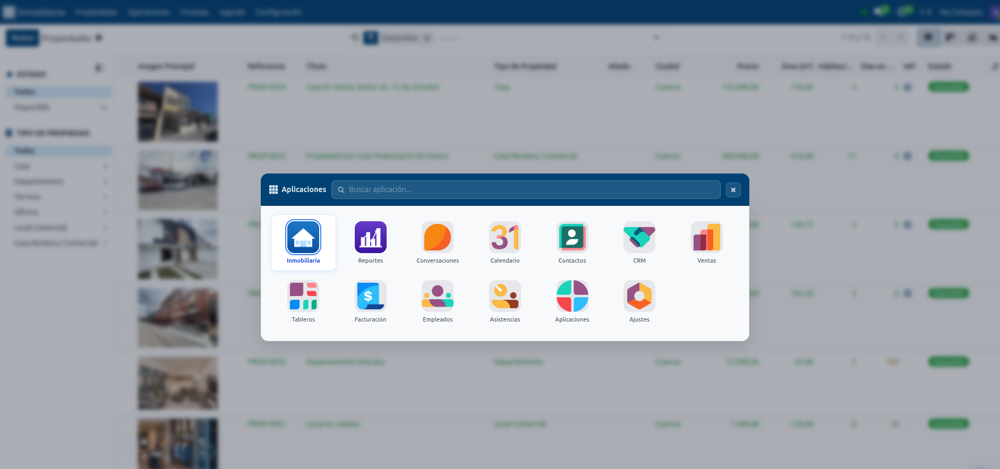

## 2. Conceptos básicos de la interfaz

| Elemento | Descripción |
|----------|-------------|
| **Menú de aplicaciones** | Cuadrícula (☰) arriba a la izquierda. Cambia entre apps. |
| **Barra de menú** | Secciones de la app activa (ej. Propiedades, Operaciones…). |
| **Vista lista** | Tabla de registros. Usa **filtros** y **agrupar por** para encontrar rápido. |
| **Vista kanban** | Tarjetas (útil en propiedades y pipeline). |
| **Ficha (formulario)** | Detalle de un registro, con pestañas y barra de estado. |
| **Barra de estado** | Arriba de la ficha: muestra y permite cambiar el ciclo de vida. |
| **Botones de acción** | A la izquierda del estado (Publicar, Vender, etc.). |
| **Chatter** | Panel derecho: historial de cambios, mensajes y actividades. |
| **Botones inteligentes** | Contadores arriba a la derecha (Citas, Leads, Documentos…). |

### Buscar y filtrar

- Escribe en la **barra de búsqueda** para filtrar por texto.
- Pulsa el desplegable para ver **filtros predefinidos** (ej. *Disponibles*, *Mis propiedades*, *Vencidos*).
- **Agrupar por** organiza la lista (por estado, ciudad, asesor…).
- Guarda tus búsquedas como **favoritas** (estrella).

> **Figura 2.1 — Vista de lista con filtros.**
> *Dónde:* Inmobiliaria → Propiedades → Catálogo (vista de lista).
> *Debe mostrar:* la tabla de propiedades y el desplegable de **Filtros / Agrupar por** abierto.
> *Archivo:* `manual_img/02_propiedades_lista.png`

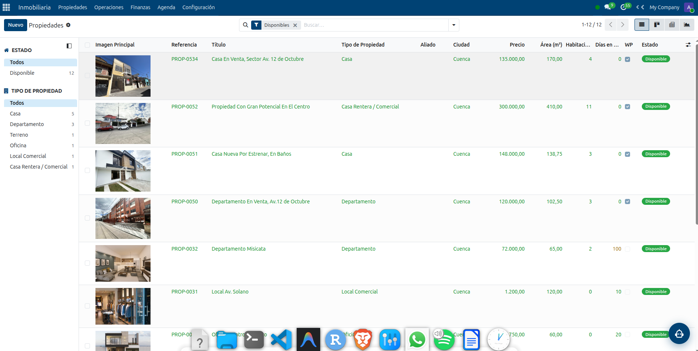

> **Figura 2.2 — Vista kanban de propiedades.**
> *Dónde:* Inmobiliaria → Propiedades → Catálogo → botón de vista **Kanban** (arriba a la derecha).
> *Debe mostrar:* las tarjetas de propiedades con su foto, precio y estado.
> *Archivo:* `manual_img/02_2_kanban.png`

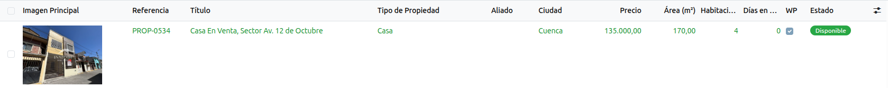

## 3. Acceso, usuarios y roles

### Ingresar

1. Abre el navegador en la dirección del servidor (ej. `http://localhost:8070` o tu dominio).
2. Ingresa **usuario** y **contraseña**.

> **Figura 3.1 — Pantalla de inicio de sesión.**
> *Dónde:* `…/web/login`.
> *Debe mostrar:* el logo de Inmobi y los campos de usuario y contraseña.
> *Archivo:* `manual_img/03_login.png`


### Roles de seguridad

| Rol | Permisos |
|-----|----------|
| **Agente** | Gestiona sus propiedades, leads, visitas, ofertas y documentos. |
| **Manager** | Todo lo del agente + reportes, comisiones, metas y configuración. |
| **Administrador** | Acceso total, incluida la configuración técnica. |
| **Marketing** | Acceso a publicación y redes sociales. |

> Los roles se asignan en **Inmobiliaria → Configuración → Roles Inmobiliarios** y **Usuarios del Sistema** (solo Administrador).

## 4. Gestión de Propiedades

**Ruta:** Inmobiliaria → Propiedades → Catálogo

### 4.1 Crear una propiedad

1. Pulsa **Nuevo**.
2. **Información general**: tipo de operación (Venta/Arriendo), tipo de propiedad, precio, precio tope (mínimo negociable), comisión (%), área.
3. **Ubicación**: dirección, ciudad, sector. Usa **"Ubicar en Mapa automáticamente"** para geocodificar.
4. **Personas**: propietario, apoderado (opcional), asesor responsable, co-asesor (opcional con % split).
5. **Características físicas**: habitaciones, baños, parqueaderos, piso, año de construcción.
6. Guarda. La propiedad nace en estado **Borrador**.

> **Figura 4.1 — Ficha de una propiedad.**
> *Dónde:* Inmobiliaria → Propiedades → abrir cualquier propiedad.
> *Debe mostrar:* la barra de estado arriba (Borrador→Disponible→…), los datos generales, ubicación y personas.
> *Archivo:* `manual_img/04_propiedad_form.png`

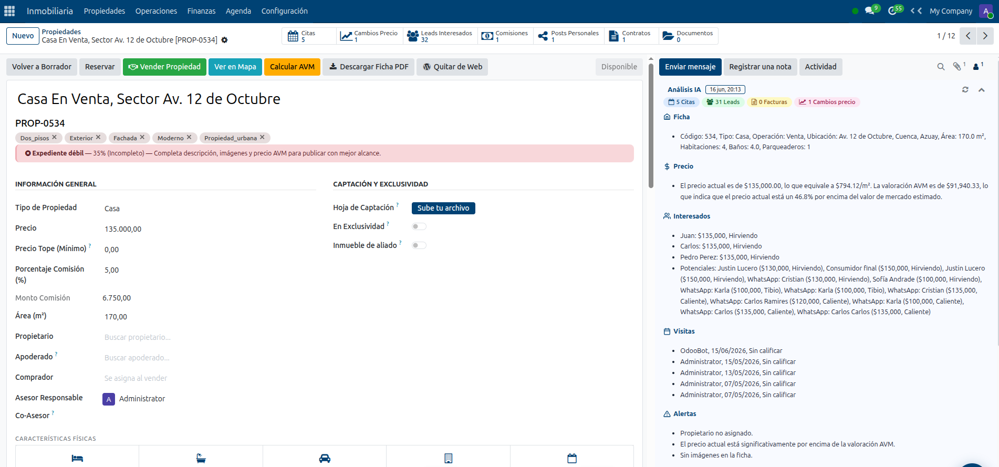

### 4.2 Pestañas de la ficha

| Pestaña | Contenido |
|---------|-----------|
| **Descripción** | Descripción comercial + herramientas de IA (ver 4.3). |
| **Multimedia** | Portada, galería (carga múltiple), Tour 360°, Código QR. |
| **Comercial** | Ofertas, historial de precios, ventas, AVM, datos del Negocio Cerrado. |
| **Financiero** | Simulador de crédito hipotecario. |
| **Publicación** | Estado de WordPress / web. |

> **Figura 4.2 — Pestaña Multimedia.**
> *Dónde:* dentro de una propiedad → pestaña **Multimedia**.
> *Debe mostrar:* la imagen principal (portada), la galería de fotos y el código QR.
> *Archivo:* `manual_img/04_2_multimedia.png`

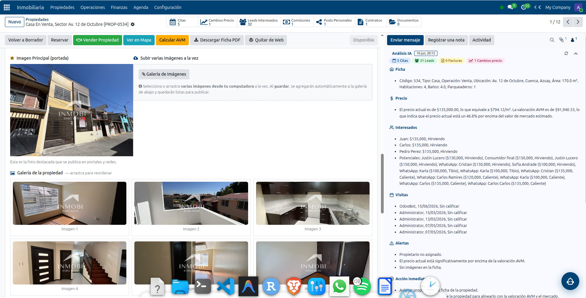

### 4.3 Descripción comercial con IA

- **Generar con IA (imagen + descripción)**: analiza la foto principal y redacta una descripción comercial profesional (HTML listo para portales).
- **Solo texto**: genera solo el texto, sin analizar imagen.
- **Detalles adicionales**: escribe lo que quieres resaltar (vista, acabados, cercanías…).
- **Refinar**: escribe instrucciones (*"hazla más corta"*, *"enfócate en la inversión"*) y pulsa **Aplicar cambios con IA**.
- El estilo/tono se configura en **Configuración → Agente IA → Estilo de Descripciones**.

> **Figura 4.3 — Descripción comercial generada con IA.**
> *Dónde:* dentro de una propiedad → pestaña **Descripción**.
> *Debe mostrar:* los botones "Generar con IA" y "Aplicar cambios con IA", y el texto de la descripción.
> *Archivo:* `manual_img/04_3_descripcion_ia.png`

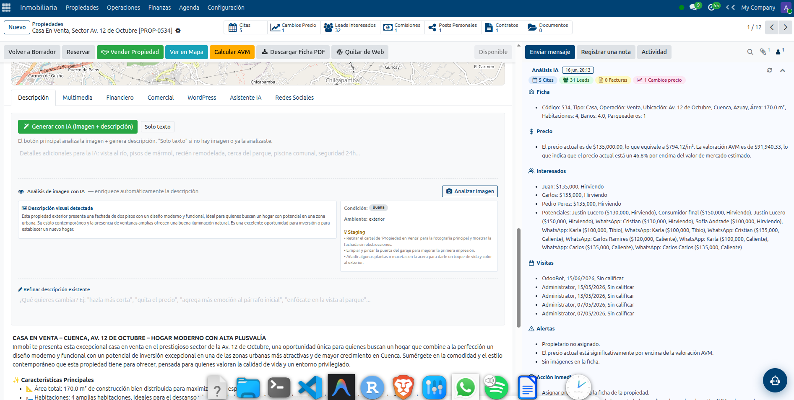

### 4.4 Valoración automática (AVM) y panel "Análisis IA"

- Botón **Calcular AVM**: estima el precio de mercado comparando propiedades similares (mismo tipo, sector, ±rango) de los últimos meses.
- Resultado: **precio estimado**, estado (**justo / alto / bajo**), confianza y nº de comparables.
- El panel **Análisis IA** (barra derecha) interpreta el resultado y sugiere acciones.

> **Figura 4.4 — AVM y panel "Análisis IA".**
> *Dónde:* dentro de una propiedad; pulsa **Calcular AVM** y abre el panel **Análisis IA** de la barra derecha.
> *Debe mostrar:* el precio estimado por AVM (con su estado) y el resumen del panel Análisis IA (precio/m², interesados, alertas).
> *Archivo:* `manual_img/04_4_avm.png`

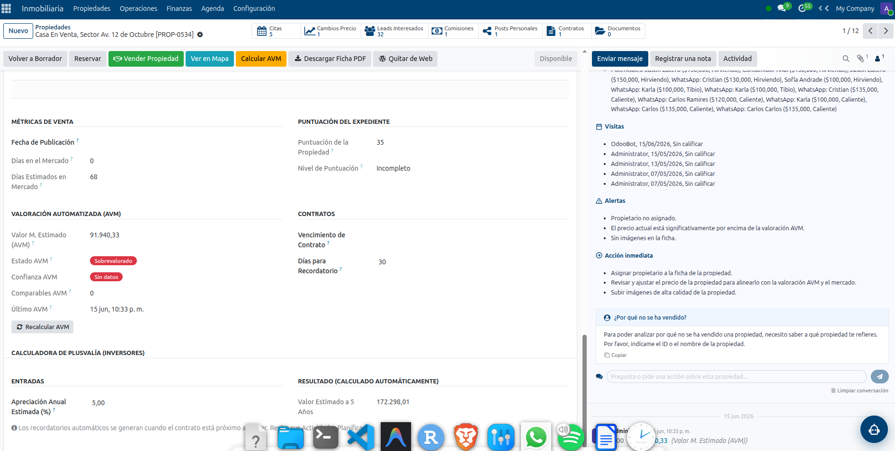

### 4.5 Ciclo de vida y accesos directos

```
Borrador → [Publicar] → Disponible → [Reservar] → Reservado
                              │                        │
                              └──────[Vender / Arrendar]┘
                                          ↓
                                   Vendido / Arrendado → [Re-listar]
```

- **Publicar en Mercado**, **Reservar**, **Vender/Arrendar** y **Re-listar** son los botones de la barra superior.
- El menú **Acción** ofrece atajos para **Nuevo Contrato** y **Nuevo Documento** ya vinculados a la propiedad.

> **Figura 4.5 — Menú "Acción" con accesos directos.**
> *Dónde:* dentro de una propiedad → despliega el menú **Acción** (arriba).
> *Debe mostrar:* las opciones **Nuevo Contrato** y **Nuevo Documento**.
> *Archivo:* `manual_img/04_5_accion.png`

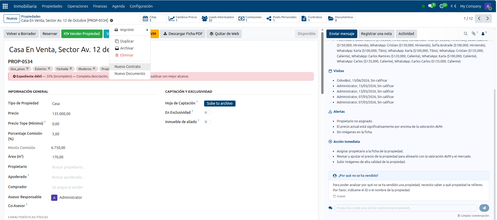

## 5. Clientes y Leads (CRM)

**App:** CRM

### 5.1 Pipeline de Leads

- **CRM → Mi Pipeline**: embudo visual por etapas. **Arrastra** las tarjetas entre etapas (Nuevo → Captación → Visita → Seguimiento → Cierre).
- Según la etapa aparecen botones contextuales (AI Matchmaker, Nueva Oferta, Reservar, Crear Contrato).

> **Figura 5.1 — Pipeline del CRM.**
> *Dónde:* CRM → Mi Pipeline (vista kanban).
> *Debe mostrar:* las columnas de etapas con las tarjetas de leads.
> *Archivo:* `manual_img/05_crm_pipeline.png`

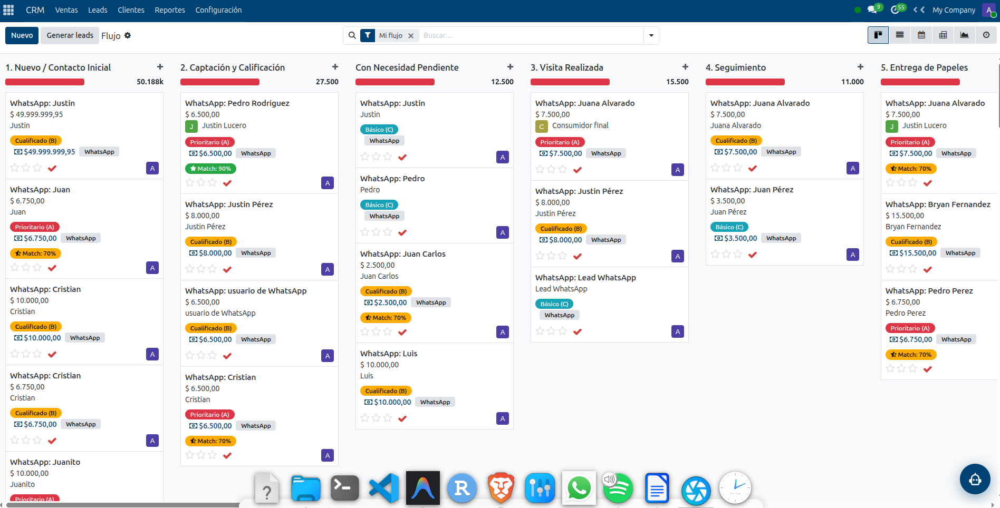

### 5.2 Datos de un lead

| Campo | Descripción |
|-------|-------------|
| **Propiedad de interés** | Inmueble que busca el cliente. |
| **Presupuesto** | Cuánto puede pagar. |
| **% de Match** | Coincidencia presupuesto ↔ precio de la propiedad. |
| **Puntuación (Score)** | A (Prioritario), B (Cualificado), C (Básico). |
| **Temperatura** | Frío, Tibio, Caliente, ¡Hirviendo! |
| **Tips de negociación IA** | Sugerencias automáticas para cerrar. |

> **Figura 5.2 — Ficha de un lead.**
> *Dónde:* CRM → abrir un lead del pipeline.
> *Debe mostrar:* la puntuación (estrellas), la temperatura, la sección "Operación Inmobiliaria" (propiedad de interés, presupuesto, % match) y los botones de acción de la barra.
> *Archivo:* `manual_img/05b_lead_form.png`

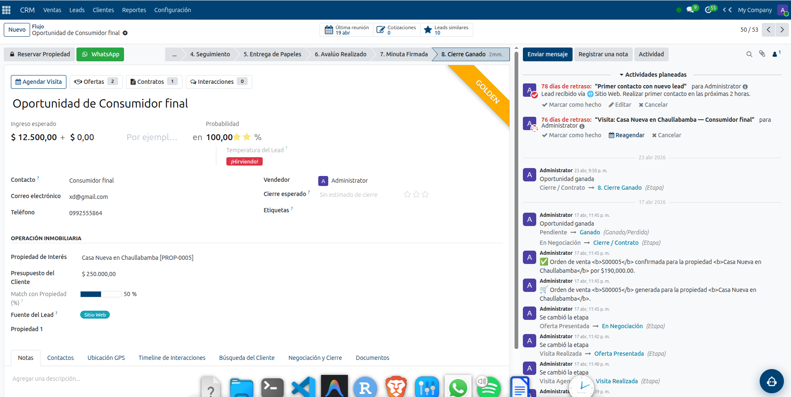

### 5.3 Clientes

- **CRM → Clientes → Directorio**: todos los contactos.
- **Gestiones realizadas**: registro de cada llamada/visita/mensaje (interacciones).
- **Clientes Pendientes**: leads sin propiedad compatible; el sistema busca cada pocas horas y **notifica por WhatsApp**.
- **Red de Aliados**: inmobiliarias/agentes con quienes compartes inventario.

> **Figura 5.3 — Directorio de clientes.**
> *Dónde:* CRM → Clientes → Directorio.
> *Debe mostrar:* la lista/kanban de clientes con sus datos de contacto.
> *Archivo:* `manual_img/05_3_clientes.png`

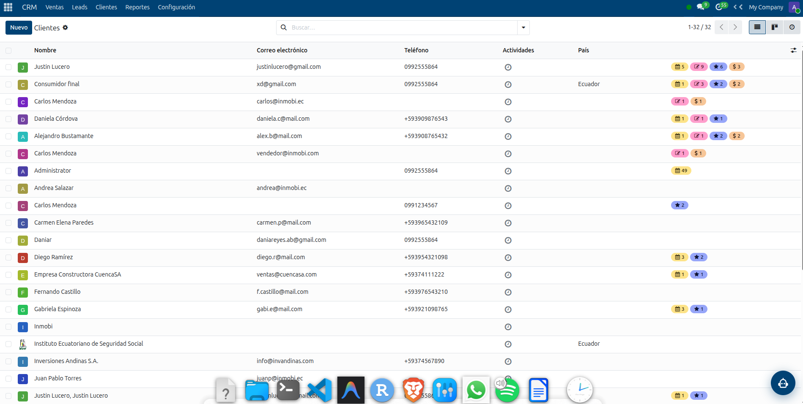

## 6. Flujo de Venta

1. En la propiedad (Disponible o Reservada), pulsa **Vender Propiedad**.
2. Completa el **asistente de venta** (*Negocio Cerrado*): comprador, precio y fecha de cierre, comisión (%), **seña/arras**, forma de pago (Contado, Hipotecario, Financiamiento del vendedor, Mixto), fecha máxima de cumplimiento y apoderado.
3. Al **Confirmar Venta**, el sistema automáticamente:
   - ✅ Crea y confirma la **Orden de Venta**.
   - ✅ Genera y contabiliza la **Factura**.
   - ✅ Marca la propiedad como **Vendida**.
   - ✅ Registra la **comisión** del asesor (dividida con co-asesor si aplica).
4. Imprime el documento **"Negocio Cerrado"**.

> **Figura 6.1 — Asistente de venta (Negocio Cerrado).**
> *Dónde:* en una propiedad Disponible/Reservada → botón **Vender Propiedad**.
> *Debe mostrar:* el formulario del asistente con comprador, precio de cierre, forma de pago y seña.
> *Archivo:* `manual_img/06_venta_wizard.png`

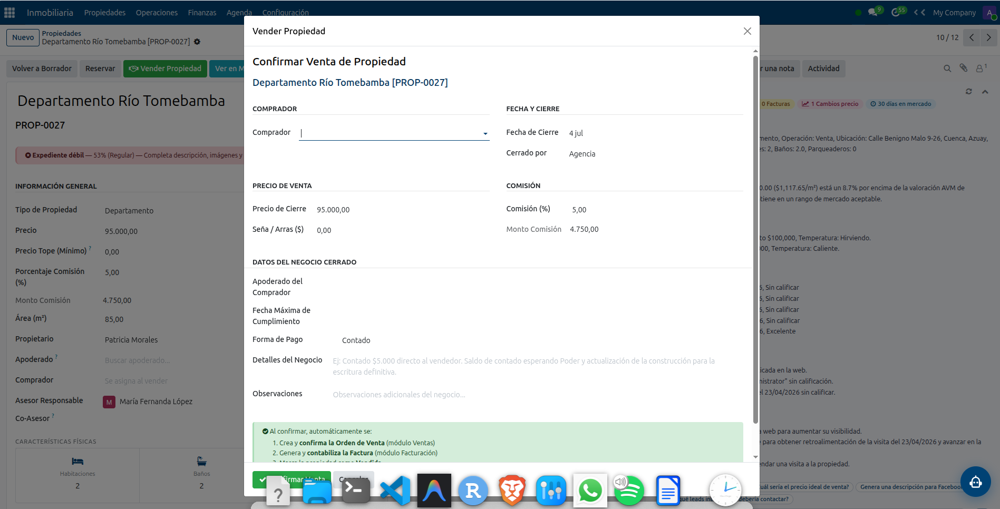

### Arriendo

- Botón **Arrendar Propiedad**: registra el canon mensual y la comisión del primer mes.

## 7. Operaciones

**Ruta:** Inmobiliaria → Operaciones

- **7.1 Contratos** — Tipos: Compraventa, Arriendo, Exclusividad. **Redactar Contrato con IA** genera el borrador legal. Ciclo: Borrador → Activo → (Suspendido / En Renovación / Renovado / Vencido / Cancelado). Firma del cliente, pagos y renovaciones. Los **PDF** se previsualizan en la barra derecha.
- **7.2 Ofertas** — Registro de ofertas recibidas (monto, descuento, financiamiento, estado).
- **7.3 Tasaciones** — Solicitudes de avalúo con motivo, fecha y resultado.
- **7.4 Solicitudes de Mantenimiento** — Pedidos de arrendatarios sobre el inmueble.
- **7.5 Depósitos / Garantías** — Garantías y depósitos de contratos de arriendo.

> **Figura 7.1 — Ficha de un contrato.**
> *Dónde:* Inmobiliaria → Operaciones → Contratos → abrir un contrato.
> *Debe mostrar:* el tipo de contrato, las partes, la barra de estado y (si hay) la previsualización del PDF a la derecha.
> *Archivo:* `manual_img/07_contrato.png`

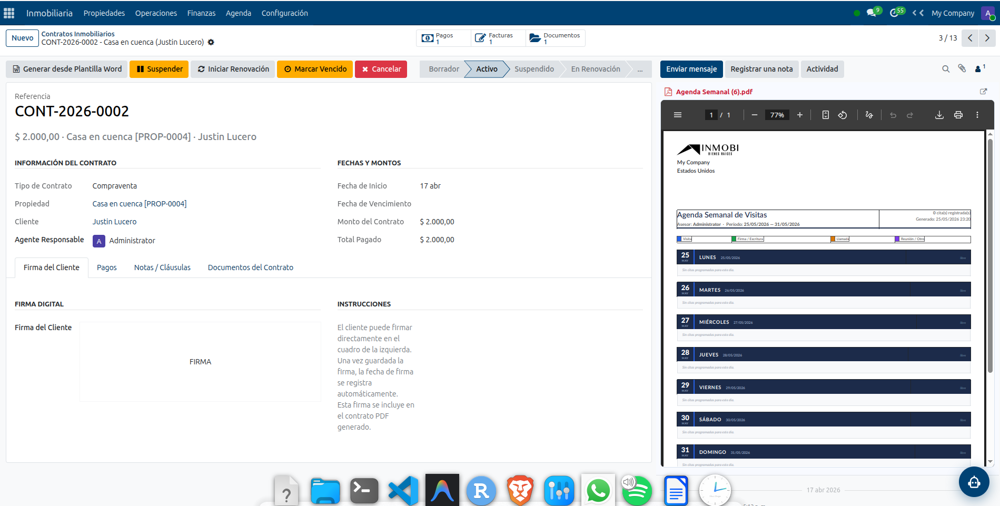

## 8. Documentos

**Ruta:** Inmobiliaria → Operaciones → Documentos

1. **Subir y clasificar** — **Nuevo** → nombre, **tipo**, confidencialidad; **vincula** a propiedad/contrato/cliente/lead; sube el **archivo** (si es PDF, se previsualiza).
2. **Extracción con IA (OCR)** — Botón **Extraer con IA**: lee el documento y extrae datos (nombres, fechas, montos, referencias).
3. **Ciclo de vida** — Pendiente → Recibido → Verificado → Archivado.
4. **Aviso de vencimiento** — Los documentos con fecha de caducidad generan un recordatorio automático.

> **Figura 8.1 — Gestión documental.**
> *Dónde:* Inmobiliaria → Operaciones → Documentos → abrir un documento (preferiblemente un PDF).
> *Debe mostrar:* los datos del documento (tipo, estado, vinculación), el botón **Extraer con IA** y la previsualización del PDF a la derecha.
> *Archivo:* `manual_img/08_documento.png`

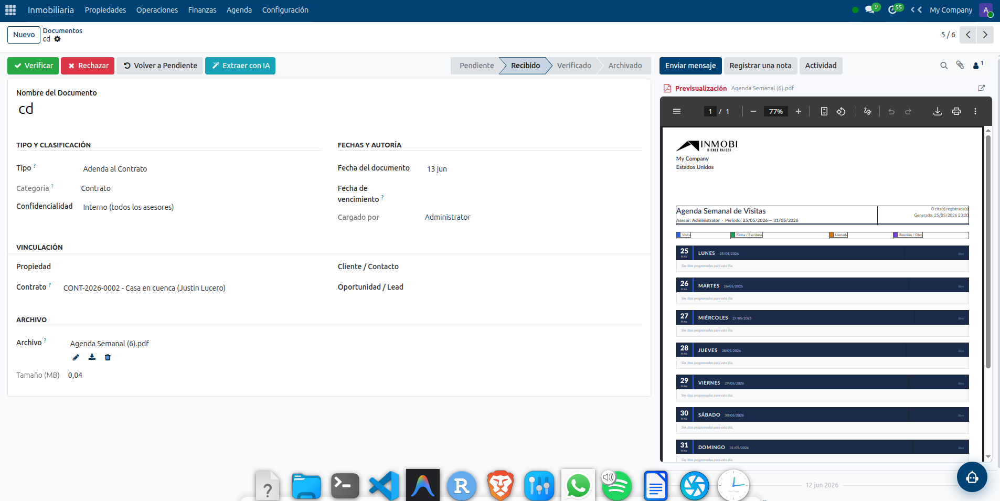

## 9. Finanzas

**Ruta:** Inmobiliaria → Finanzas

| Sección | Descripción |
|---------|-------------|
| **Pagos de Venta** | Cuotas y abonos de ventas. |
| **Pagos de Arrendamiento** | Cánones mensuales de arriendo. |
| **Gastos de Propiedad** | Gastos asociados a inmuebles. |
| **Pagos de Comisiones** | Comisiones por asesor (Borrador → Aprobada → Pagada). |
| **Nómina / Sueldos** | Sueldo base, bono de comisiones, subsidios, deducciones IESS, neto. Genera **recibo en PDF**. |

> **Figura 9.1 — Comisiones / Finanzas.**
> *Dónde:* Inmobiliaria → Finanzas → Pagos de Comisiones (o el reporte "Estado de Pago de Comisiones").
> *Debe mostrar:* la lista de comisiones por asesor con su estado (devengada/aprobada/pagada).
> *Archivo:* `manual_img/09_finanzas.png`

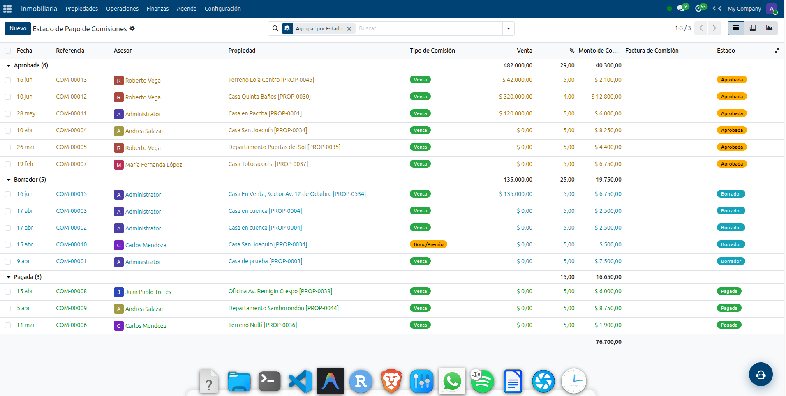

> **Figura 9.2 — Recibo de nómina en PDF.**
> *Dónde:* Inmobiliaria → Finanzas → Nómina/Sueldos → abrir un rol de pago → **Imprimir → Recibo de Nómina**.
> *Debe mostrar:* el PDF con haberes, deducciones y neto a pagar.
> *Archivo:* `manual_img/09_2_nomina.png`

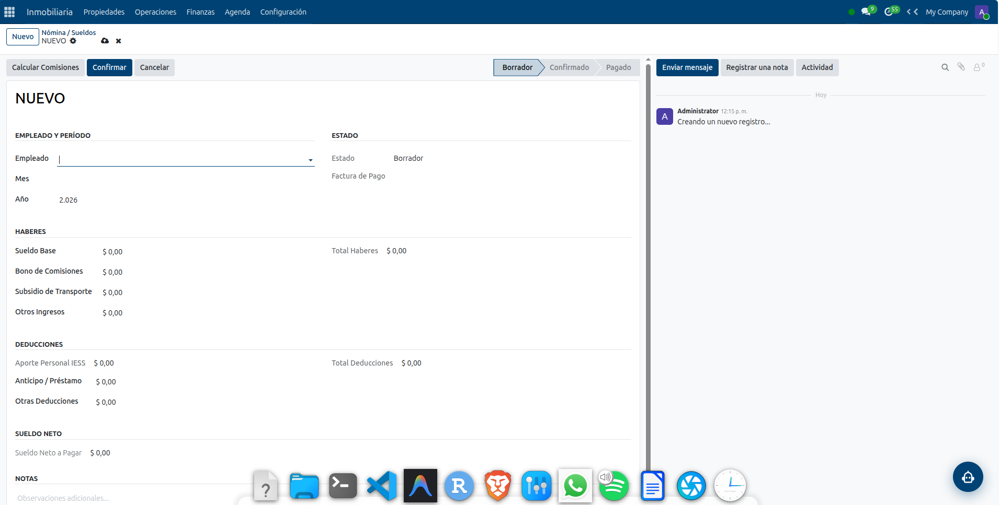

## 10. Agenda y Visitas

**Ruta:** Inmobiliaria → Agenda

- **Calendario de Citas**: agenda visitas a propiedades (fecha, cliente, asesor, tipo).
- Recordatorio por **WhatsApp** ~1 hora antes (al asesor y, opcionalmente, al cliente).
- Acciones de una cita (barra superior): **Visita Realizada**, **WhatsApp Seguimiento**, **Encuesta**, **Cancelar**, **Re-programar**.
- **Días no disponibles** y **Calculadora Hipotecaria**.

> **Figura 10.1 — Calendario de visitas.**
> *Dónde:* Inmobiliaria → Agenda → Calendario de Citas.
> *Debe mostrar:* el calendario con visitas agendadas (y, si abres una, sus botones de acción).
> *Archivo:* `manual_img/10_calendario.png`

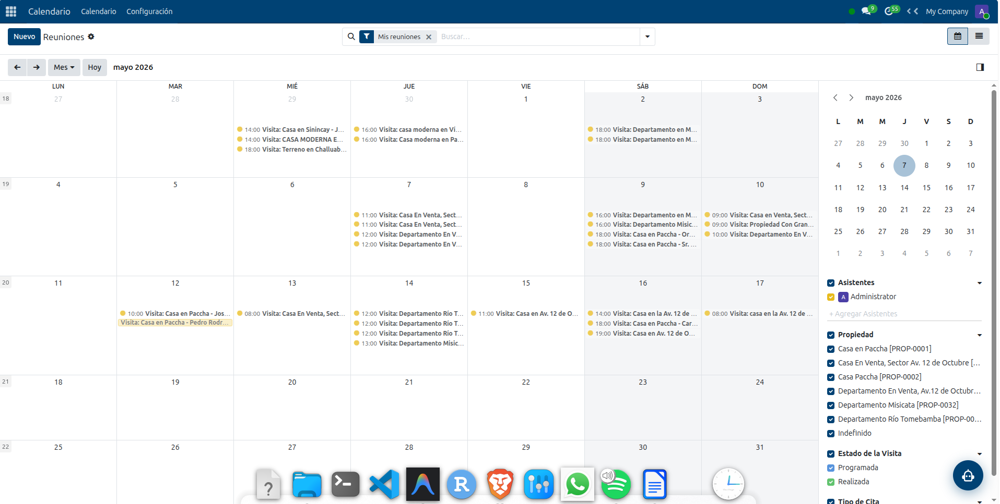

## 11. Reportes e Inteligencia de Negocio

**App:** Reportes

### 11.1 Dashboard Ejecutivo

Filtros (asesor, período) y pestañas: **Resumen** (KPIs, metas con semáforo, tendencia), **Gráficos**, **CRM/Embudo**, **Asesores** y **Mercado**. Botones inteligentes (Disponibles, Ofertas, Contratos, Visitas, Estancadas, Por Vencer), **Exportar a PDF** y **Pregunta a la IA**.

> **Figura 11.1 — Dashboard Ejecutivo (Resumen).**
> *Dónde:* app **Reportes** → Dashboard.
> *Debe mostrar:* los KPIs, las barras de cumplimiento de metas y los botones inteligentes.
> *Archivo:* `manual_img/11_dashboard.png`

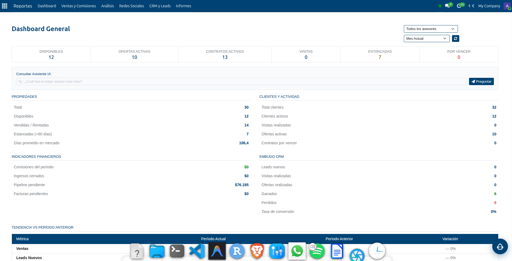

> **Figura 11.2 — Gráficos del dashboard.**
> *Dónde:* Reportes → Dashboard → pestaña **Gráficos** (o **CRM/Embudo**).
> *Debe mostrar:* los gráficos de ventas por mes y leads por fuente (o el funnel de conversión).
> *Archivo:* `manual_img/11_2_graficos.png`

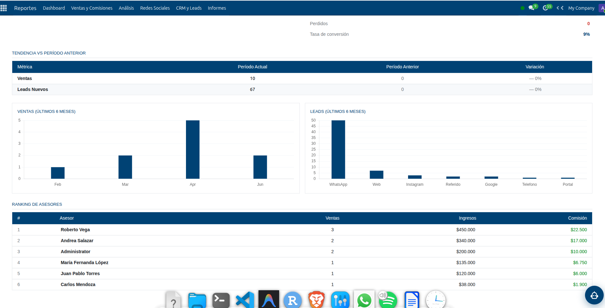

### 11.2 Metas de Ventas

**Reportes → Ventas → Metas**: objetivos de cierres, ingresos y comisiones por asesor y mes. Semáforo (🟢 ≥100% · 🟡 ≥70% · 🔴 <70%).

### 11.3 Secciones de Reportes

- **Ventas**: por Mes, Ranking de Asesores, Metas, Comisiones, Estado de Pago, Análisis de Cierres.
- **Análisis**: pivots/gráficos por modelo (Propiedades, Contratos, Pagos, Ofertas, Días en Mercado…).
- **Informes**: Exportar Datos, Liquidación de Comisiones, Reporte de Visitas, Comparar Propiedades.

## 12. Asistente con Inteligencia Artificial

El asistente vive en el **botón flotante** (esquina inferior derecha), disponible en todo el sistema.

### 12.1 Cómo usarlo

- Escribe en **lenguaje natural**. Entiende contexto (recuerda la propiedad/lead del que hablas).
- Responde con texto, **gráficos** (Línea/Barras), tablas y enlaces de descarga.
- Valora cada respuesta con 👍 / 👎.

> **Figura 12.1 — Chat flotante del Asistente IA.**
> *Dónde:* pulsa el botón flotante (abajo a la derecha) en cualquier pantalla y haz una consulta.
> *Debe mostrar:* la ventana del chat con una pregunta y su respuesta (idealmente con un gráfico o tabla).
> *Archivo:* `manual_img/12_chat_ia.png`

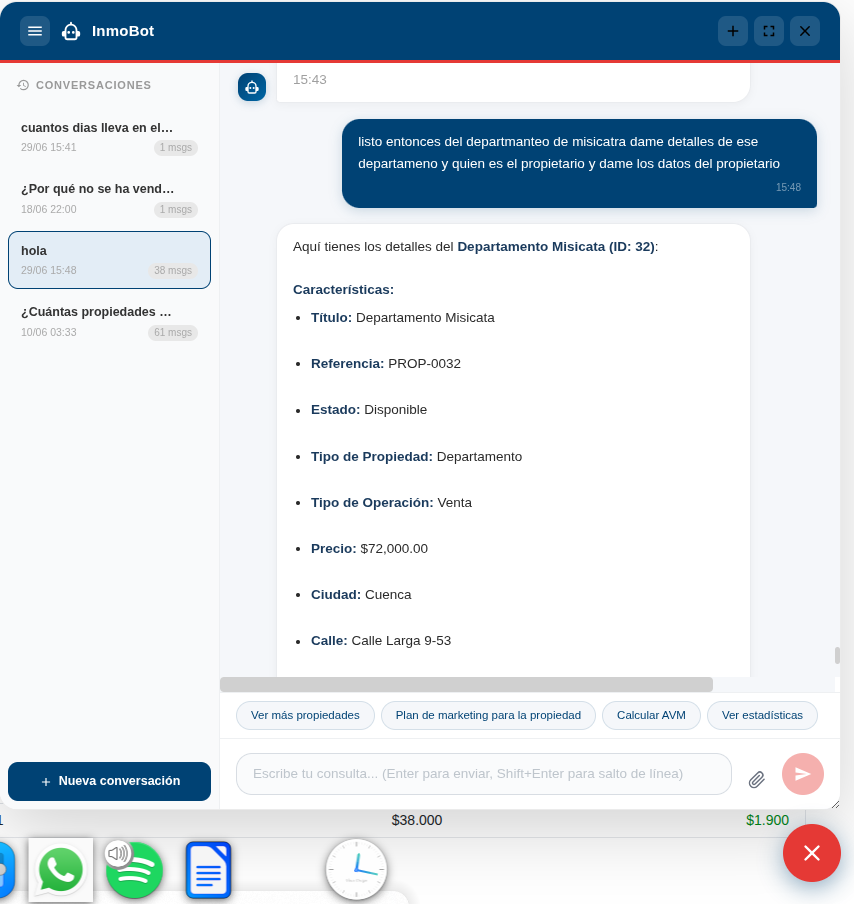

### 12.2 Qué puede hacer

- **Consultar**: *"¿Cuál es mi propiedad con más prospectos?"*, *"Pagos vencidos"*, *"Visitas de esta semana"*.
- **Reportes con gráficos**: *"Reporte de ventas por mes"*, *"Leads por temperatura"*, *"Informe ejecutivo del mes"*, *"Descargar PDF / Exportar a Excel"*.
- **Crear y gestionar**: *"Crea un lead para Juan Pérez, presupuesto 150000"*, *"Agenda una visita…"*, *"Reserva la propiedad PROP-0052"*.
- **Marketing y análisis**: *"Genera una descripción de marketing…"*, *"Plan de campaña…"*, *"Recalcula el AVM…"*, *"Compara estas dos propiedades"*.
- **Documentación (RAG)**: *"¿Cómo creo un contrato?"*, *"¿Qué hace el módulo de WordPress?"* → responde citando los manuales.

> El asistente admite **dos proveedores de IA** (Gemini y OpenAI) con respaldo automático.

## 13. Integraciones

| Integración | Función |
|-------------|---------|
| **WordPress** | Publica y sincroniza propiedades al sitio web (tema Houzez), con re-sincronización automática opcional. |
| **Redes Sociales** | Publica en Facebook/Instagram y registra posts de asesores; estadísticas. |
| **WhatsApp** | Recordatorios de visitas y notificaciones a clientes (Meta Cloud API). |
| **n8n** | Workflows de automatización (agentes virtuales, búsquedas, catálogos). |
| **IA (Gemini / OpenAI)** | Descripciones, OCR, contratos, chat y análisis. |

## 14. Configuración

**Ruta:** Inmobiliaria → Configuración (Manager / Administrador)

- **Roles Inmobiliarios** y **Usuarios del Sistema**.
- **Tipos de Inmueble** y **Tipos de Documento**.
- **Asistente IA** (Ajustes → Agente IA): proveedor activo, **API Keys por proveedor** (OpenAI y Gemini), modelo, estilo de descripciones, prompt del sistema y **Reindexar Base de Conocimiento (RAG)**.
- **Integraciones**: WordPress (incl. re-sincronización automática), redes sociales, WhatsApp (incl. recordar al cliente).

> **Figura 14.1 — Ajustes del Agente IA.**
> *Dónde:* Ajustes → **Agente IA Inmobiliario** (o Inmobiliaria → Configuración).
> *Debe mostrar:* el proveedor activo, los campos de API Key de OpenAI y Gemini, y el botón **Reindexar conocimiento**.
> *Archivo:* `manual_img/14_ajustes_ia.png`

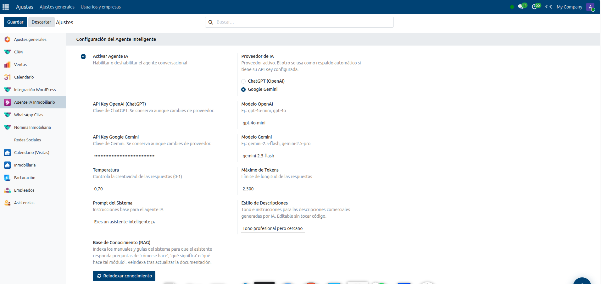

## 15. Preguntas frecuentes y solución de problemas

**No veo el botón "Vender Propiedad".** La propiedad debe estar **Disponible** o **Reservada** y de tipo Venta.

**El asistente IA no responde.** Verifica en **Configuración → Agente IA** que haya **API Key** válida y el agente activo. Si un proveedor se queda sin crédito, configura el otro como respaldo.

**El asistente responde sobre otra propiedad.** Nómbrala explícitamente ("el departamento de Misicata"); el asistente prioriza la propiedad que nombras o la última de la conversación.

**No se publica en WordPress (error 401).** El usuario de WordPress necesita rol **Editor** o superior y una Application Password válida.

**502 al abrir el sitio tras actualizar.** Reinicia el proxy: `docker compose restart nginx`.

## 16. Glosario

| Término | Significado |
|---------|-------------|
| **AVM** | *Automated Valuation Model* — valoración automática de mercado. |
| **Lead** | Prospecto / oportunidad de venta en el CRM. |
| **Score (A/B/C)** | Calidad del lead: Prioritario / Cualificado / Básico. |
| **Temperatura** | Cercanía al cierre: Frío → Tibio → Caliente → Hirviendo. |
| **Negocio Cerrado** | Datos del cierre de una venta (comprador, seña, pago, etc.). |
| **RAG** | Generación aumentada por recuperación: el asistente responde desde la documentación. |
| **Chatter** | Panel de mensajes e historial a la derecha de cada ficha. |
| **Pipeline** | Embudo de oportunidades del CRM. |

<div style="page-break-after: always;"></div>

## Anexo A — Lista completa de capturas

Toma cada captura, guárdala en `docs/manual_img/` con el nombre indicado y regenera el PDF.
Las marcadas con **(auto)** las genera el script `tools/capturar_manual.py`; el resto son
capturas manuales (requieren abrir una pestaña o hacer un clic concreto).

| Figura | Archivo | Pantalla | Qué debe mostrar |
|--------|---------|----------|------------------|
| 1.1 | `01_apps_home.png` (auto) | Menú de apps (☰) | Íconos de las apps |
| 2.1 | `02_propiedades_lista.png` (auto) | Propiedades (lista) | Tabla + filtros |
| 2.2 | `02_2_kanban.png` | Propiedades (kanban) | Tarjetas con foto/precio/estado |
| 3.1 | `03_login.png` (auto) | `/web/login` | Logo + usuario/contraseña |
| 4.1 | `04_propiedad_form.png` (auto) | Ficha de propiedad | Estado, datos, ubicación, personas |
| 4.2 | `04_2_multimedia.png` | Propiedad → Multimedia | Portada, galería, QR |
| 4.3 | `04_3_descripcion_ia.png` | Propiedad → Descripción | Botones de IA + texto |
| 4.4 | `04_4_avm.png` | Propiedad (AVM + panel IA) | Precio AVM + Análisis IA |
| 4.5 | `04_5_accion.png` | Propiedad → menú Acción | Nuevo Contrato / Nuevo Documento |
| 5.1 | `05_crm_pipeline.png` (auto) | CRM → Pipeline | Columnas de etapas con leads |
| 5.2 | `05b_lead_form.png` (auto) | Ficha de lead | Score, temperatura, operación |
| 5.3 | `05_3_clientes.png` | CRM → Clientes | Directorio de clientes |
| 6.1 | `06_venta_wizard.png` | Propiedad → Vender Propiedad | Asistente de venta |
| 7.1 | `07_contrato.png` | Operaciones → Contratos | Ficha de contrato + PDF |
| 8.1 | `08_documento.png` | Operaciones → Documentos | Documento + Extraer con IA + PDF |
| 9.1 | `09_finanzas.png` | Finanzas → Comisiones | Comisiones por asesor/estado |
| 9.2 | `09_2_nomina.png` | Nómina → Recibo (PDF) | Haberes, deducciones, neto |
| 10.1 | `10_calendario.png` | Agenda → Calendario | Calendario con visitas |
| 11.1 | `11_dashboard.png` (auto) | Reportes → Dashboard | KPIs, metas, botones |
| 11.2 | `11_2_graficos.png` | Dashboard → Gráficos | Gráficos / funnel |
| 12.1 | `12_chat_ia.png` | Botón flotante (chat) | Pregunta + respuesta |
| 14.1 | `14_ajustes_ia.png` | Ajustes → Agente IA | Proveedores, claves, reindexar |

## Anexo B — Cómo capturar e insertar las imágenes

1. **Inicia el sistema** y accede con tu usuario.
2. Abre la pantalla indicada en cada figura (columna "Pantalla").
3. Toma la captura (Linux: `gnome-screenshot -a` para recortar; Windows: **Win+Shift+S**).
4. Guárdala en `docs/manual_img/` con el **nombre exacto** de la columna "Archivo".
5. Las **(auto)** puedes generarlas con:
   `source venv19/bin/activate && python tools/capturar_manual.py`
6. Regenera el PDF: `bash docs/build_manual_pdf.sh`
   (el script **omite** automáticamente las figuras cuya imagen aún no exista, así que puedes ir avanzando por partes).

---

*Inmobi Community — Sistema de Gestión Inmobiliaria sobre Odoo 19.*
